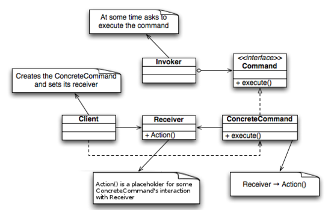

Reference Book : [Java 언어로 배우는 디자인 패턴 입문](https://www.youngjin.com/book/book_detail.asp?prod_cd=9788931436914&seq=4628&cate_cd=1&child_cate_cd=&goPage=11&orderByCd=3), Yuki Hiroshi, 영진닷컴

---

### Proxy 패턴

> 객체가 진짜로 필요해지면 생성하는 패턴

처음 생성될 때 엄청나게 복잡하고 오래 걸리는 객체가 있는데, 그 객체 안의 변수 하나를 얻기 위해 객체를 생성하는 것은 비효율적이다. 어느정도 간단한건 대리인(Proxy)가 해주다가, 진짜로 중요한 메소드 실행이 필요해지는 경우는 돼야 객체를 생성한다는 컨셉

#### 예제 프로그램

객체 생성이 엄청 오래 걸리는 프린터가 있다. 프린터의 설정값(프린터 이름) IO 같은 간단한 행동은 대리인에게 맡기고, 가장 중요한 메소드인 print() 정도는 호출되어야 실제 프린터 객체를 생성해서 동작하는 프로그램.

|Name|Description|
|:--:|:----------|
|Printer|프린터를 나타내는 클래스|
|PrinterProxy|프린터 대리인을 나타내는 클래스|
|Printable|Printer와 PrinterProxy 공통의 클래스|

```java
public class Printer implements Printable {
    private String name;
    public Printer() {
        heavyJob("Printer instance 생성중");
    }

    public Printer(String name) {
        this.name = name;
        heavyJob("Printer " + name + " instance 생성중");
    }

    public void setPrinterName(String name) {
        this.name = name;
    }

    public String getPrinterName() {
        return name;
    }

    public void print(String string) {
        System.out.println("===" + name + "===");
        System.out.println(string);
    }

    private void heavyJob(String msg) {
        System.out.println(msg);
        for(int i = 0; i < 5; i++) {
            try {
                Thread.sleep(1000);
            } catch(InterruptedException e) {
                e.printStackTrace();
            }
            System.out.println(".");
        }
        System.out.println("Done.");
    }
}
```

```java
public interface Printable {
    public void setPrinterName(String name);
    public String getPrinterName();
    public void print(String string);
}
```

프린터가 할 수 있는 일들은 일단 Printable 인터페이스에 선언해줘야한다. 대리인이 할지 실제 객체가 할지는 대리인이 판단하면 된다. <U>사용하는 입장에서 대리인을 둬도, 실제 객체를 사용해도 동일한 방법으로 사용 가능해야한다.</U>

```java
public class PrinterProxy implements Printable {
    private String name;
    private Printer real;
    public PrinterProxy() {}
    public PrinterProxy(String name) {
        this.name = name;
    }

    public synchronized void setPrinterName(String name) {
        if(real != null) real.setPrinterName(name);
        this.name = name;
    }
    public String getPrinterName() {
        return name;
    }
    public void print(String string) {
        realize();
        real.print(string);
    }
    private synchronized void realize() {
        if(real == null) {
            real = new Printer(name);
        }
    }
}
```

```java
public class Main {
    public static void main(String[] args) {
        Printable p = new PrinterProxy("Alice");
        System.out.println("프린터 현재 이름 : " + p.getPrinterName());
        p.setPrinterName("Bob");
        System.out.println("프린터 현재 이름 : " + p.getPrinterName());
        p.print("Hello world!");
    }
}
```

#### 연습 문제

Q. 예제 프로그램에서 실제 객체는 대리인에 대한 정보를 알고 있지 않고, 알 필요도 없다. 하지만 반대의 경우인 대리인 클래스 안에는 실제 프린터 객체가 될 Printer가 선언되어 있다.  
대리인도 실제 객체에 대한 정보를 '몰라도 상관없도록' 만들어보자. <b>(Reflection 사용)</b>

```java
public class PrinterProxy implements Printable {
    private String name;
    private Printable real;
    private String realClass;

    public PrinterProxy() {}
    public PrinterProxy(String name, String realClass) {
        this.name = name;
        this.realClass = realClass;
    }

    public synchronized void setPrinterName(String name) {
        if(real != null) real.setPrinterName(name);
        this.name = name;
    }
    public String getPrinterName() {
        return name;
    }
    public void print(String string) {
        realize();
        real.print(string);
    }
    private synchronized void realize() {
        if(real == null) {
            try {
                real = (Printable) Class.forName(realClass).newInstance();
                real.setPrinterName(name);
            } catch(ClassNotFoundException e) {
                e.printStackTrace();
            } catch(InstantiationException e) {
                e.printStackTrace();
            } catch(IllegalAccessException e) {
                e.printStackTrace();
            }
        }
    }
}
```

### Command 패턴

> 메소드 호출에 대한 이력을 남기기 위한 패턴

단순히 객체와 객체간에 직접 메소드 호출을 하는 상황에서 이력을 남기기 위해서는 일일히 로그를 위한 처리를 해줘야한다.  
Command 패턴은 메소드 호출을 '명령' 이라고 생각하고 명령을 관리하는 클래스를 만들어 호출과 이력관리를 일관되게 만드는 컨셉이다.



* Command (ConcreteCommand)

명령의 상세 내용과 실제로 수행하는 메소드를 갖고있는 객체(인터페이스)

* Receiver

명령이 수행될 때 그 행동에 영향을 받게 되는 객체

* Client

명령을 생성하고 전달하는 객체

* Invoker

전달된 명령을 실행(execute)하는 객체

#### 예제 프로그램

간단한(?) 그림 그리는 프로그램. '이 위치에 점을 그려라', '모두 지워라' 하는 식으로 모든 동작은 <b>*명령*</b>으로 구성된다.

|Package|Name|Description|
|:-----:|:--:|:----------|
|command|Command|'명령' 인터페이스|
|command|MacroCommand|'명령들을 모은 명령' 클래스|
|drawer|DrawCommand|'점 그리기 명령' 클래스|
|drawer|Drawable|'그려지는 곳'에 대한 인터페이스|
|drawer|DrawCanvas|'그려지는 곳(Receiver)'을 구현한 클래스|

```java
package command;

public interface Command {
    public void execute();
}
```

```java
package command;

import java.util.Iterator;
import java.util.Stack;

public class MacroCommand implements Command {
    private Stack commands = new Stack();
    public void execute() {
        Iterator it = commands.iterator();
        while(it.hasNext()) {
            ((Command) it.next()).execute();
        }
    }

    public void append(Command cmd) {
        if(cmd != this) {
            commands.push(cmd);
        }
    }

    public void undo() {
        if(!commands.empty()) {
            commands.pop();
        }
    }

    public void clear() {
        commands.clear();
    }
}
```

```java
package drawer;

public interface Drawable {
    public void draw(int x, int y);
}
```

```java
package drawer;

import java.awt.Canvas;
import java.awt.Color;
import java.awt.Graphics;

import command.MacroCommand;

public class DrawCanvas extends Canvas implements Drawable {
    private Color color = Color.red;
    private int radius = 6;
    private MacroCommand history;

    public DrawCanvas(int width, int height, MacroCommand history) {
        setSize(width, height);
        setBackground(Color.white);
        this.history = history;
    }
    
    public void paint(Graphics g) {
        history.execute();
    }

    public void draw(int x, int y) {
        Graphics g = getGraphics();
        g.setColor(color);
        g.fillOval(x - radius, y - radius, radius*2, radius*2);
    }
}
```

```java
package drawer;

import java.awt.Point;

import command.*;

public class DrawCommand implements Command {
    protected Drawable drawable;
    private Point position;

    public DrawCommand(Drawable drawable, Point position) {
        this.drawable = drawable;
        this.position = position;
    }

    public void execute() {
        drawable.draw(position.x, position.y);
    }
}
```

#### 연습 문제

Q. '그리기 색을 설정'하는 명령 ColorCommand 클래스를 새로 만들어보자

```java
package drawer;

import java.awt.Color;

public interface Drawable {
    public void draw(int x, int y);
    public void setColor(Color color);
}
```

```java
package drawer;

import java.awt.Color;
import java.awt.Point;

import command.*;

public class ColorCommand implements Command {
    protected Drawable drawable;
    private Color color;

    public ColorCommand(Drawable drawable, boolean colorToggle) {
        this.drawable = drawable;
        color = (colorToggle) ? Color.red : Color.blue;
    }

    public void execute() {
        drawable.setColor(color);
    }
}
```

```java
package drawer;

import java.awt.Canvas;
import java.awt.Color;
import java.awt.Graphics;

import command.MacroCommand;

public class DrawCanvas extends Canvas implements Drawable {
    private Color color = Color.red;
    private int radius = 6;
    private MacroCommand history;

    public DrawCanvas(int width, int height, MacroCommand history) {
        setSize(width, height);
        setBackground(Color.white);
        this.history = history;
    }
    
    public void paint(Graphics g) {
        history.execute();
    }

    public void draw(int x, int y) {
        Graphics g = getGraphics();
        g.setColor(color);
        g.fillOval(x - radius, y - radius, radius*2, radius*2);
    }

    public void setColor(Color color) {
        this.color = color;
    }
}
```

---

## Image Reference

https://zetawiki.com/wiki/Java_%EC%96%B8%EC%96%B4%EB%A1%9C_%EB%B0%B0%EC%9A%B0%EB%8A%94_%EB%94%94%EC%9E%90%EC%9D%B8_%ED%8C%A8%ED%84%B4_%EC%9E%85%EB%AC%B8