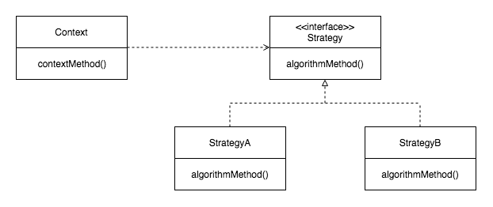
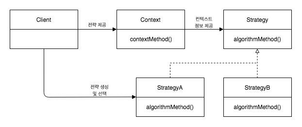

Reference Book : [토비의 스프링 3.1](http://acornpub.co.kr/book/toby-spring3-1-vol2), 이일민, 에이콘 출판사

[Spring Study - (2)](../14)

---

# 템플릿

개방-폐쇄 원칙OCP는 확장에는 열려있고 변경에는 닫혀 있어야 한다는 원칙이다. 이 원칙은 어떤 부분은 변경을 통해 기능이 <U>확장되려는 성질</U>이 있고, 어떤 부분은 고정되어 <U>변하지 않으려는 성질</U>이 있다는 것을 설명해준다.

템플릿이란 코드 변경이 거의 일어나지 않는 성질을 가진 부분을 독립시켜서 효과적으로 활용할 수 있도록 하는 방법이다.

## 예외상황 처리

JDBC 코드에는 반드시 지켜야할 원칙이 있다. JDBC 코드의 흐름을 따르지 않고 중간에 *예외가 발생하면 반드시 리소스를 반환*해줘야 한다. 

```java
public void deleteAll() throws SQLException {
	Connection c = dataSource.getConnection();

	PreparedStatement ps = c.prepareStatement(
			"DELETE FROM USERS"
	);
	ps.executeUpdate();

	ps.close();
	c.close();
}
```

위 코드에서 DELETE 쿼리를 실행하는 과정에서 에러가 발생하면 <U>리소스를 반환</U>하고 예외를 발생시켜야 한다. 

```java
public void deleteAll() throws SQLException {
	Connection c = null;
	PreparedStatement ps = null;
	try {
		c = dataSource.getConnection();
		ps = c.prepareStatement(
				"DELETE FROM USERS"
		);
		ps.executeUpdate();
	} catch(SQLException e) {
		throw e;
	} finally {
		if(ps != null) {
			try {
				ps.close();
			} catch(SQLException e) {}
		}
		if(c != null) {
			try {
				c.close();
			} catch(SQLException e) {}
		}
	}
}
```

getCount() 메소드에도 똑같이 예외처리를 넣어준다.

```java
public int getCount() throws SQLException {
	Connection c = null;
	PreparedStatement ps = null;
	ResultSet rs = null ;
	
	try {
		c = dataSource.getConnection();
		ps = c.prepareStatement(
				"SELECT COUNT(*) FROM USERS"
		);
		rs = ps.executeQuery();
		rs.next();
		return rs.getInt(1);
	} catch(SQLException e) {
		throw e;
	} finally {
		if(rs != null) {
			try {
				rs.close();
			} catch(SQLException e) {}
		}
		if(ps != null) {
			try {
				ps.close();
			} catch(SQLException e) {}
		}
		if(c != null) {
			try {
				c.close();
			} catch(SQLException e) {}
		}
	}
}
```

찝찝하다. 

try-catch-finally가 중복해서 나타나는데다가 코드 depth가 너무 깊어지고, SQL 관련 메소드마다 if문을 걸어주고.. 게다가 예외상황은 테스트하기도 어렵기 때문에 잘못된 것을 찾기도 어렵다.

이 문제의 핵심은 *변하지는 않지만 많은 곳에서 중복되는* <U>코드를 분리</U>해내는 작업이다. 

### 전략 패턴의 적용

단순 메소드 추출 방식이나, 템플릿 메소드(변경되는 기능 메소드를 제외하고는 상속해서 사용)는 논리적으로 맞지 않거나 확장 유연성이 떨어지는 문제가 있다.



전략패턴은 변하지 않는 부분(Context)과 변하는 부분(Strategy A,B)을 <U>별도의 클래스로 만들고</U>, 확장할 기능은 추상화된 인터페이스(Strategy)에 위임해서 동작시키는 패턴이다.

JDBC 동작을 수행하는 메소드는 변하지 않는 맥락Context을 가지게 된다. 
> 1. DB 커넥션 가져오기
> 2. PreparedStatement를 만들어줄 외부 기능 호출
> 3. PreparedStatement 실행
> 4. 예외 발생시 throw
> 5. PreparedStatement와 Connection close

전략 패턴에서 말하는 전략Strategy는 이중에서 2번에서 말하는 '외부 기능'이 된다. 이 외부 기능을 인터페이스의 구현체로 만들어두고 사용하는 형태가 된다.

```java
public interface StatementStrategy {
	PreparedStatement makePreparedStatement(Connection c) throws SQLException;
}
```

```java
public class DeleteAllStatement implements StatementStrategy {
	@Override
	public PreparedStatement makePreparedStatement(Connection c) throws SQLException {
		PreparedStatement ps = c.prepareStatement("DELETE FROM USERS");
		return ps;
	}

}
```

```java
public void deleteAll() throws SQLException {
	...
	try {
		c = dataSource.getConnection();
		
		StatementStrategy strategy = new DeleteAllStatement();
		ps = strategy.makePreparedStatement(c);
		
		ps.executeUpdate();
	}
	...
```

하지만 이런 식으로 구현한면 DeleteAllStatement()라는 구체적인 구현체 자체를 알고 있어야하기 때문에 단순히 PreparedStatement를 생성하는 기능을 별도에 메소드로 뺀것에 지나지 않는다. 구체적인 내용을 몰라도 되는 공통적인 코드가 하나 있어야 한다는 느낌이 온다.



전략 패턴에서는 Context가 어떤 전략을 사용하게 될 것인가는 그 앞단의 Client가 결정하는게 일반적이다. *Client가 구체적인 전략 하나를 선택하고 <U>오브젝트로 만들어서 Context로 전달</U>하는 것*이다.

현재 deleteAll() 메소드에서 
```java
StatementStrategy strategy = new DeleteAllStatement();
```
이 한줄을 제외하고는 모두 Context 코드이기 때문에 별도의 메소드로 분리시켜야 한다.

```java
public void jdbcContextWithStatementStrategy(StatementStrategy stmt) throws SQLException {
	Connection c = null;
	PreparedStatement ps = null;
	try {
		c = dataSource.getConnection();
		ps = stmt.makePreparedStatement(c);
		ps.executeUpdate();
	} catch(SQLException e) {
		throw e;
	} finally {
		if(ps != null) {
			try {
				ps.close();
			} catch(SQLException e) {}
		}
		if(c != null) {
			try {
				c.close();
			} catch(SQLException e) {}
		}
	}
}
```
jdbcContextWithStatementStrategy는 구체적으로 사용할 전략에 대한 정보는 전혀 모르고, 외부에서 전달해주는 전략을 받아서 수행할 뿐이다. 이 '외부'가 여기서는 deleteAll() 메소드가 된다. DeleteAllStatement라는 하나의 전략 오브젝트를 생성해서 jdbcContextWithStatementStrategy에 전달해주기만 하면 된다.

```java
public void deleteAll() throws SQLException {
	StatementStrategy st = new DeleteAllStatement();
	jdbcContextWithStatementStrategy(st);
}
```

---

동일한 방식으로 add() 메소드에도 전략을 적용해보자. 먼저 <U>변하는 부분</U>을 전략의 구현체로 만들어야한다.

```java
public class AddStatement implements StatementStrategy {
	User user;
	
	public AddStatement(User user) {
		this.user = user;
	}

	@Override
	public PreparedStatement makePreparedStatement(Connection c) throws SQLException {
		PreparedStatement ps = c.prepareStatement(
				"INSERT INTO USERS(id,name,password) VALUES (?, ?, ?)"
		);
		ps.setString(1,  user.getId());
		ps.setString(2,  user.getName());
		ps.setString(3,  user.getPassword());
		
		return ps;
	}

}
```

구현된 전략을 오브젝트로 만들어서 넘겨주기만 하면 된다.

```java
public void add(User user) throws SQLException {
	StatementStrategy st = new AddStatement(user);
	jdbcContextWithStatementStrategy(st);
}
```

---

충분히 깔끔하게 정리된 것 같지만 약간의 불만이 남아있다. 이런 식으로 만들다보면 전략 하나당 하나의 클래스가 발생하게 되는데, 이 때문에 파일이 너무 많아진다. 

또한 add(User user) 메소드 같은 경우 별도의 생성자를 만들어서 user 정보의 객체를 넘겨야 해서 약간의 메모리 낭비가 발생한다. 

클래스 파일이 많아지는 문제는 간단하게 로컬 클래스로 해결할 수 있다. DeleteAllStatement나 AddStatement나 어차피 DAO 내부에서만 사용된다. 그러면 DAO 내부에 로컬 클래스로 선언해두면 그만이다.

```java
public void add(User user) throws SQLException {
	class AddStatement implements StatementStrategy {
		User user;
		
		public AddStatement(User user) {
			this.user = user;
		}

		@Override
		public PreparedStatement makePreparedStatement(Connection c) throws SQLException {
			PreparedStatement ps = c.prepareStatement(
					"INSERT INTO USERS(id,name,password) VALUES (?, ?, ?)"
			);
			ps.setString(1,  user.getId());
			ps.setString(2,  user.getName());
			ps.setString(3,  user.getPassword());
			
			return ps;
		}

	}
	
	StatementStrategy st = new AddStatement(user);
	jdbcContextWithStatementStrategy(st);
}
```

이렇게하면 또다른 장점이 생긴다. AddStatement가 어차피 add(User user) 메소드 안에 있으니 user 정보를 따로 넘겨주지 않아도 user를 알 수 있다는 점이다. 이러면 쓸데없는 생성자나 파라미터를 하나씩 줄일 수 있다.

```java
public void add(final User user) throws SQLException {
	class AddStatement implements StatementStrategy {
		@Override
		public PreparedStatement makePreparedStatement(Connection c) throws SQLException {
			PreparedStatement ps = c.prepareStatement(
					"INSERT INTO USERS(id,name,password) VALUES (?, ?, ?)"
			);
			ps.setString(1,  user.getId());
			ps.setString(2,  user.getName());
			ps.setString(3,  user.getPassword());
			
			return ps;
		}

	}
	
	StatementStrategy st = new AddStatement();
	jdbcContextWithStatementStrategy(st);
}
```

---

더 욕심을 내서 리팩토링을 해보자면, 사실 AddStatement 클래스는 add 메소드 안에서 전략을 생성하는 일 외에는 다른 용도가 없기 때문에 별도의 이름도 필요가 없다. 이런 경우 <U>익명 클래스</U> (안드로이드 하다보면 많이 보게되는)로 만들어버리는 것도 가능하다.

```java
public void add(final User user) throws SQLException {
	StatementStrategy st = new StatementStrategy() {
		@Override
		public PreparedStatement makePreparedStatement(Connection c) throws SQLException {
			PreparedStatement ps = c.prepareStatement(
					"INSERT INTO USERS(id,name,password) VALUES (?, ?, ?)"
			);
			ps.setString(1,  user.getId());
			ps.setString(2,  user.getName());
			ps.setString(3,  user.getPassword());
			
			return ps;
		}
	};
	jdbcContextWithStatementStrategy(st);
}
```

비슷한 이유로 전략 오브젝트도 한번만 사용되고 말 것이기 때문에 따로 변수 선언도 안해주는 수도 있다.

```java
jdbcContextWithStatementStrategy(
	new StatementStrategy() {
		@Override
		public PreparedStatement makePreparedStatement(Connection c) throws SQLException {
			PreparedStatement ps = c.prepareStatement(
					"INSERT INTO USERS(id,name,password) VALUES (?, ?, ?)"
			);
			ps.setString(1,  user.getId());
			ps.setString(2,  user.getName());
			ps.setString(3,  user.getPassword());
			
			return ps;
		}
	}
);
```

---

Image Reference

https://hychul.github.io/spring/2018/04/04/tobis-spring-3.1-vol1-chapter3/