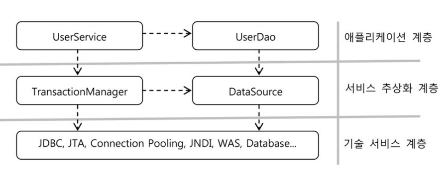

Reference Book : [토비의 스프링 3.1](http://acornpub.co.kr/book/toby-spring3-1-vol2), 이일민, 에이콘 출판사

[Spring Study - (3)](../15)

---

# 예외

자바에서 Exception은 다루기 귀찮지만 중요한 기능이다.  
그냥 출력하고 넘어가는 방법도 있고, 위로 throw만 하는 방법도 있는데 무책임한 방법이다. 

### 예외의 종류

명시적인 처리가 가능한 예외

* Error : 시스템적으로 비정상적인 상황에 발생(out of memory, thread death 등)
* Exception : 
  * Checked Exception : 해당 Exception이 발생하면 반드시 catch하거나 throw 해야함
  * Unchecked Exception : RuntimeException이 이 경우인데, 꼭 catch할 필요가 없음

### 예외처리 방법

* 예외 복구 : try-catch
* 예외처리 회피 : throws
* 예외 전환
  * 발생한 예외를 그대로 throw 해줄 경우 의미가 불분명해지는 경우
  * Checked Exception을 RuntimeException으로 포장(wrap)해서 넘겨주기


### 예외처리 전략

* 런타임 예외
  * throws Exception으로 점철된 의미없는 메소드들이 많아지면서 예외처리가 너무 번거로워짐
  * RuntimeException으로 만들어서 넘겨주도록 처리

* 어플리케이션 예외
  * 시스템이나 외부의 예외상황이 아니라 어플리케이션 로직에서 발생시키는 예외
  * try-catch로 꼭 예외 상황을 처리해줘야 한다

### UserDAO의 예외처리

UserDAO에서 JdbcTemplate을 적용하기 이전에는 DB 쿼리를 실행하는 메소드에서 SQLException을 던져줘야 했다. 하지만 JdbcTemplate을 적용하면서 예외처리가 전부 사라졌다. SQLException은 어디로 갔을까?

JdbcTemplate의 메소드들은 DB 관련 에러를 런타임 에러인 DataAccessException으로 전환하여 던져주고 있어서 사용측에서 처리 의무가 없도록 해준다. 

### Java 표준 Persistence의 예외처리

* JDBC, JPA, 하이버네이트 등 Data Access 기술에서 Exception을 어떻게 다루는지에 대한 설명
* <U>이 부분은 나중에 다시 읽어봐야할듯</U>

## 기술에 독립적인 UserDAO 만들기

지금까지 만든 UserDAO 클래스를 인터페이스와 구현으로 나눠보자. 구현체는 JDBC를 이용할 수도 있고, JPA나 하이버네이트를 이용할 수도 있다. 인터페이스는 DAO의 기능을 사용하려는 클라이언트들이 필요한 것만 추출하면 된다.

```java
public interface UserDAO {
	void add(User user);
	User get(String id);
	List<User> getAll();
	int getCount();
	void deleteAll();
}
```

```java
public class UserDAOJdbc implements UserDAO {
	...
```

```xml
<bean id="userDao" class="tobi.user.dao.UserDAOJdbc">
	<property name="dataSource" ref="dataSource" /> 
</bean>
```

동일한 Key를 가진 오브젝트를 등록시켜서 예외를 발생시키는 테스트 코드를 만들어보자.

```java
@Test(expected=DataAccessException.class)
public void duplicateKey() {
	dao.deleteAll();
	
	dao.add(user1);
	dao.add(user1);
}
```

DataAccessException이 발생하기 때문에 테스트가 통과된다. 하지만 이 Exception은 JDBC에서만 발생하기 때문에 이 테스트를 범용적으로 사용할 수는 없다. (예를 들어, 하이버네이트는 같은 상황에서 ConstaintViolationException을 발생시킴)  
만약 DAO에서 사용하는 기술에 상관없이 동일한 예외를 얻고 싶다면, 스프링의 예외 전환 클래스(SQLExceptionTranslator)를 사용해야한다.

```java
@Test
public void sqlExceptionTranslate() {
	dao.deleteAll();
	
	try {
		dao.add(user1);
		dao.add(user1);
	} catch(DuplicateKeyException ex) {
		SQLException sqlEx = (SQLException) ex.getRootCause();
		SQLExceptionTranslator set = new SQLErrorCodeSQLExceptionTranslator(this.dataSource);
		
		assertThat(set.translate(null, null, sqlEx), is(instanceOf(DuplicateKeyException.class)));
	}
}
```

# 서비스 추상화

시대가 지나고 환경과 상황에 따라 기술이 바뀌고, 그에 따라 다른 API를 사용하고, 다른 스타일의 접근 방법을 사용하고.. 머리가 아프다. 스프링을 통해 어떻게 여러 종류의 기술을 추상화하고 일관된 방법으로 사용할 수 있도록 지원하는지 배워본다.

## UserDAO 비즈니스 로직

기존의 UserDAO에는 간단한 CRUD 기능만 있었다. 여기에 간단한 비즈니스 로직을 추가해보자.

> 1. 사용자 레벨 추가 (BASIC, SILVER, GOLD)
> 2. 첫 가입시 BASIC 레벨, 이후 활동에 따라 업그레이드 된다
> 3. 50회 이상 로그인 시 SILVER
> 4. SILVER 레벨에서 30회 이상 추천 받으면 GOLD
> 5. 레벨 변경은 조건이 충족돼도 즉시 일어나는 것이 아니라, 일정한 주기를 가지고 일괄적으로 처리

### 필드 추가

* Level enum

회원 등급에 대한 정보부터 시작해보자. DB에 varchar로 "GOLD", "SILVER" 이렇게 넣는 방법도 있겠지만 굳이? 각 레벨을 코드화해서 숫자로 관리하면 보다 쉽고 가볍게 관리가 가능하다. 그렇다고 DAO에 사용될 프로퍼티도 숫자로 표현하면? 다루기 쉽기야 하겠지만 타입이 안전하지 않다는 단점이 있다. (잘못된 값 입력 등)

이런 경우엔 보통 enum을 쓴다

```java
public enum Level {
	BASIC(1), SILVER(2), GOLD(3);
	
	private final int value;
	
	Level(int value) {
		this.value = value;
	}
	
	public int intValue() {
		return value;
	}
	
	public static Level valueOf(int value) {
		switch(value) {
			case 1 : return BASIC;
			case 2 : return SILVER;
			case 3 : return GOLD;
			default : throw new AssertionError("Unknown error : " + value);
		}
	}
}
```

이러면 DB에 저장할 int 타입의 값을 갖고 있으면서도, setLevel(1000) 같은 잘못된 메소드 사용이 불가능(1000은 Level type이 아니기 때문)해지기 때문에 안전하다.

* User 필드 내용 추가

User 필드에 방금 생성한 Level 변수를 추가한다. 로그인 횟수와 추천 횟수를 표현할 login, recommend 변수(int)도 추가한다. DB의 User 테이블도 업데이트 하고, DAO, Test코드 등에 새로운 멤버와 관련된 내용을 모두 반영한다.

```java
public User(String id, String name, String password) {
	this.id = id;
	this.name = name;
	this.password = password;
	this.level = Level.BASIC;
	this.login = 1;
	this.recommend = 0;
}
```

```java
public class UserDAOJdbc implements UserDAO {
	private JdbcTemplate jdbcTemplate;
	
	public void setDataSource(DataSource dataSource) {
		this.jdbcTemplate = new JdbcTemplate(dataSource);
	}
	
	public void add(final User user) {
		this.jdbcTemplate.update(
				"INSERT INTO USERS(id,name,password,level,login,recommend) VALUES (?, ?, ?, ?, ?, ?)",
				user.getId(), user.getName(), user.getPassword(), user.getLevel().intValue(), user.getLogin(), user.getRecommend()
		);
	}
	
	public void deleteAll() {
		this.jdbcTemplate.update(
				"DELETE FROM USERS"
		);
	}
	
	public int getCount() {
		return this.jdbcTemplate.queryForObject(
				"SELECT COUNT(*) FROM USERS", 
				int.class
		);
	}
	
	public User get(String id) {
		return this.jdbcTemplate.queryForObject(
				"SELECT * FROM USERS WHERE id=?", 
				new Object[] {id}, // 파라미터로 사용될 배열
				this.userMapper
		); 
	}

	public List<User> getAll() {
		return this.jdbcTemplate.query(
				"SELECT * FROM USERS ORDER BY id",
				this.userMapper
		);
	}
	
	private RowMapper<User> userMapper = new RowMapper<User>() {
		public User mapRow(ResultSet rs, int rowNum) throws SQLException {
			User user = new User();
			user.setId(rs.getString("id"));
			user.setName(rs.getString("name"));
			user.setPassword(rs.getString("password"));
			user.setLevel(Level.valueOf(rs.getInt("level")));
			user.setLogin(rs.getInt("login"));
			user.setRecommend(rs.getInt("recommend"));
			return user;
		}
	};
}
```

### 사용자 수정 기능 추가

DAO에 사용자 정보를 수정하는 메소드 update()를 추가한다. 먼저 update() 메소드를 테스트할 테스트 코드를 먼저 작성한다.

```java
@Test
public void update() {
	dao.deleteAll();
	dao.add(user1);
	
	user1.setName("U1up");
	user1.setPassword("pass1up");
	user1.setLevel(Level.GOLD);
	user1.setLogin(1000);
	user1.setRecommend(999);
	dao.update(user1);
	
	User user1up = dao.get(user1.getId());
	checkSameUser(user1up, user1);
}
```

테스트 코드가 정상적으로 동작할 수 있도록 DAO에 update() 메소드를 추가한다. (이전에 DAO가 인터페이스 형태로 변경됐기 때문에 DAO 인터페이스와 구현체에 모두 update()를 추가해야한다.)

```java
public void update(User user) {
	this.jdbcTemplate.update(
			"UPDATE USERS SET name=?, password=?, level=?, login=?, recommend=? WHERE id=?",
			user.getName(), user.getPassword(), user.getLevel().intValue(), user.getLogin(), user.getRecommend(), user.getId()
	);
}
```

### UserService

사용자 정보를 수정하는 단계까지 됐으니, 이제 사용자 정보를 '어떤 기준으로 업데이트 한다' 라는 비즈니스 로직을 추가해야 한다. 비즈니스 로직은 어디에 두어야할까? DAO에 두는 것은 바람직하지 않다. DAO는 단순히 데이터를 어떻게 넣고빼는지에 관한 클래스이지, 비즈니스 로직이 들어가서는 안된다. 비즈니스 로직을 담기 위한 클래스 UserService를 하나 추가한다.

UserService는 UserDAO를 주입받아 사용하는데, UserDAO의 구현에 영향을 받지 않도록 해야한다. 그리고 UserService를 위한 테스트 클래스도 하나 추가한다.

```java
public class UserService {
	UserDAO userDao;
	
	public void setUserDao(UserDAO userDao) {
		this.userDao = userDao;
	}
}
```

```xml
<bean id="userService" class="tobi.user.dao.UserService">
	<property name="userDao" ref="userDao" /> 
</bean>
```

```java
@RunWith(SpringJUnit4ClassRunner.class)
@ContextConfiguration(locations="/test-applicationContext.xml")
public class UserServiceTest {
	@Autowired
	UserService userService;

	@Test
	public void bean() {
		assertThat(this.userService, is(notNullValue()));
	}
}
```

이제 사용자의 레벨을 변경하는 로직을 추가한다. 위에서 설명한 레벨 상승 로직을 구현한다.

```java
public void upgradeLevels() {
	List<User> users = userDao.getAll();
	
	for(User user : users) {
		Boolean changed = false;
		if(user.getLevel() == Level.BASIC && user.getLogin() >= 50) {
			user.setLevel(Level.SILVER);
			changed = true;
		}
		else if(user.getLevel() == Level.SILVER && user.getRecommend() >= 30) {
			user.setLevel(Level.GOLD);
			changed = true;
		}
		
		if(changed)
			userDao.update(user);
	}
}
```

```java
@RunWith(SpringJUnit4ClassRunner.class)
@ContextConfiguration(locations="/test-applicationContext.xml")
public class UserServiceTest {
	List<User> users;
	
	@Autowired
	UserDAO userDao;
	@Autowired
	UserService userService;

	@Before
	public void setUp() {
		User u1 = new User("U1", "U1Name", "pass1");
		u1.setLevel(Level.BASIC);
		u1.setLogin(49);
		u1.setRecommend(0);
		User u2 = new User("U2", "U2Name", "pass2");
		u2.setLevel(Level.BASIC);
		u2.setLogin(50);
		u2.setRecommend(0);
		User u3 = new User("U3", "U3Name", "pass3");
		u3.setLevel(Level.SILVER);
		u3.setLogin(60);
		u3.setRecommend(29);
		User u4 = new User("U4", "U4Name", "pass4");
		u4.setLevel(Level.SILVER);
		u4.setLogin(60);
		u4.setRecommend(30);
		User u5 = new User("U5", "U5Name", "pass5");
		u5.setLevel(Level.GOLD);
		u5.setLogin(100);
		u5.setRecommend(100);
		users = Arrays.asList(u1,u2,u3,u4,u5);
	}
	
	@Test
	public void upgradeLevels() {
		userDao.deleteAll();
		for(User user : users) {
			userDao.add(user);
		}
		
		userService.upgradeLevels();
		
		checkLevel(users.get(0), Level.BASIC);
		checkLevel(users.get(1), Level.SILVER);
		checkLevel(users.get(2), Level.SILVER);
		checkLevel(users.get(3), Level.GOLD);
		checkLevel(users.get(4), Level.GOLD);
	}
	
	private void checkLevel(User user, Level expectedLevel) {
		User userUpdate = userDao.get(user.getId());
		assertThat(userUpdate.getLevel(), is(expectedLevel));
	}
}
```

이제 리팩토링의 시간이다.  
일단 if 분기들이 맘에 들지 않는다. 플래그 사용도 맘에 안든다. 그 외에도 매직넘버등 자잘한 문제들이 있다.

가장 먼저 추상적인 레벨에서 보면, 자주 변경될 가능성이 있는 구체적인 내용이 추상적인 흐름과 섞여 있다. 먼저 메소드를 추상적인 흐름으로만 표현해보자.

```java
public void upgradeLevels() {
	List<User> users = userDao.getAll();
	
	for(User user : users) {
		if(canUpgradeLevel(user)) {
			upgradeLevel(user)
		}
	}
}
```

안의 구체적으로 어떻게 구현돼있는지 상관하지 않으면, 논리적인 흐름은 위의 코드와 같다. (1)유저별로 (2)레벨업이 가능하면 (3)레벨업 한다. 이제 논리적인 흐름대로 구체적인 메소드를 구현해보자.

```java
private boolean canUpgradeLevel(User user) {
	Level curLevel = user.getLevel();
	switch(curLevel) {
		case BASIC : return (user.getLogin() >= 50);
		case SILVER : return (user.getRecommend() >= 30);
		case GOLD: return false;
		default :
			throw new IllegalArgumentException("Unknown level : " + curLevel);
	}
}

private void upgradeLevel(User user) {
	if(user.getLevel() == Level.BASIC) user.setLevel(Level.SILVER);
	else if(user.getLevel() == Level.SILVER) user.setLevel(Level.GOLD);
	userDao.update(user);
}
```

이정도로도 충분히 동작은 하지만 upgradeLevel() 메소드는 좀더 개선이 필요해보인다. 우선 예외처리(만약 User가 GOLD 레벨이라면 탈 로직이 없으니 예외임) 부분이 없고, 어차피 각 단계에서 다음 레벨은 정해져 있는데 굳이 Service의 if 문에서 상승될 레벨을 지정해주는 것도 불필요해 보인다. 다음 레벨이 뭔지 알아내는 정도는 Level에서 구현해도 충분하다.

```java
public enum Level {
	GOLD(3, null), SILVER(2, GOLD), BASIC(1, SILVER);
	
	private final int value;
	private final Level next;
	
	Level(int value, Level next) {
		this.value = value;
		this.next = next;
	}
	
	public Level nextLevel() {
		return this.next;
	}
	...
```

이런식으로 enum 내부에서 각 레벨의 다음 레벨을 미리 지정해놓을 수 있다. 이제 Service에서 '특정 레벨로 올려라'라고 할 필요 없이 '다음 레벨로 올려라'라는 요청만 하면 된다.  
(책에서는 User 클래스에 upgradeLevel() 메소드를 또 구현했는지 이게 맞는지 모르겠다. User는 VO같은 오브젝트로 사용중인데 거기에 로직을 넣는건 아닌거같다. 일단은 내 생각대로 Service에서 레벨업 해주는 로직 구현)

```java
private void upgradeLevel(User user) {
	Level nextLevel = user.getLevel().nextLevel();
	user.setLevel(nextLevel);
	userDao.update(user);
}
```

변경된 upgradeLevel() 메소드를 따라 테스트 클래스도 수정해야한다. 기존 테스트 클래스에서는 업그레이드된 레벨을 일일히 파라미터로 명시해줘야했지만, nextLevel을 활용하도록 바꿔야한다.

```java
@Test
public void upgradeLevels() {
	userDao.deleteAll();
	for(User user : users) {
		userDao.add(user);
	}
	
	userService.upgradeLevels();
	
	// Upgrade 대상이면 true, 아니면 false
	checkLevelUpgraded(users.get(0), false);
	checkLevelUpgraded(users.get(1), true);
	checkLevelUpgraded(users.get(2), false);
	checkLevelUpgraded(users.get(3), true);
	checkLevelUpgraded(users.get(4), false);
}

private void checkLevelUpgraded(User user, boolean upgraded) {
	User userUpdate = userDao.get(user.getId());
	
	if(upgraded)
		assertThat(userUpdate.getLevel(), is(user.getLevel().nextLevel()));
	else 
		assertThat(userUpdate.getLevel(), is(user.getLevel()));
}
```

매직넘버도 이쯤해서 처리해두자

```java
public class UserService {
	public static final int MIN_LOGCOUNT_FOR_SILVER = 50;
	public static final int MIN_RECOMMEND_FOR_GOLD = 30;
	...
	switch(curLevel) {
		case BASIC : return (user.getLogin() >= MIN_LOGCOUNT_FOR_SILVER);
		case SILVER : return (user.getRecommend() >= MIN_RECOMMEND_FOR_GOLD);
		...
```

## Transaction Service 추상화

100명의 회원이 있는 상태에서, 90명의 레벨 관리가 이루어진 상태에서 서버 장애로 중단되었다. 이런 상황에서 해결법은 어떻게 될까?  

(1) 기왕 작업한게 아까우니 그냥 그대로 두고 복구된 후 나머지 회원 관리를 처리한다.  
(2) 일부 사용자는 레벨이 조정됐는데 일부는 안됐다면 반발이 심할 수 있다. 모두 되돌리고 나중에 다시 처리한다.
 
현재까지 작성한 레벨 관리 코드는 어떻게 동작하고 있을까? 테스트를 만들어서 확인해보자. 하지만 이번 테스트는 중간에 강제로 에러를 발생시켜야 하는 것이기 때문에 작성하기 쉽지 않다. 예외가 던져지는 상황을 의도적으로 만들어야 한다.

### 테스트용 Service

예외가 던져지는 상황을 만드는 가장 쉬운 방법은 당연히 어플리케이션 코드를 수정하는 방법이다. 하지만 이미 잘 동작하고 있는 코드에 테스트를 위해서 굳이 예외 상황을 넣는 일은 함부로 해서는 안된다. 그래서 테스트를 위한 Service 클래스를 만든다. 
물론 아예 새로운 클래스를 만드는건 아니고, 상속한 후 오버라이딩해서 쓴다.


```java
public class TestUserService extends UserService { 
	private String id;
	
	private TestUserService(String id) {
		this.id = id;
	}
	
	protected void upgradeLevel(User user) {
		if(user.getId().equals(this.id)) throw new TestUserServiceException();
		super.upgradeLevel(user);
	}
}
```

특정 id를 가진 User를 관리하는 단계에서 강제로 Exeption을 발생시키도록 구현된 테스트용 Service 코드다. 이 Service를 사용하는 테스트 코드를 작성한다. 기대하는 동작은 작업 중간에 중단되면 기존 작업됐던 내용도 모두 원복되는 것이다.

```java
@Test
public void upgradeAllOrNothing() {
	UserService testUserService = new TestUserService(users.get(3).getId());
	testUserService.setUserDao(this.userDao);
	
	userDao.deleteAll();
	for(User user : users) userDao.add(user);
	
	try {
		testUserService.upgradeLevels();
		fail("TestUserServiceException expected");
	} catch (TestUserServiceException e) {
	}
	
	checkLevelUpgraded(users.get(1), false);
}
```

..는 fail.  
즉 기대한대로 원복되는 것이 아니라, 중단되더라도 작업된 내용은 저장되고 있는 것이다.

이는 레벨 관리 기능이 하나의 <b>트랜잭션transaction</b> 안에서 동작하지 않았기 때문이다. 여러번의 SQL 쿼리 수행을 하나의 트랜잭션으로 취급하기위해 JDBC는 트랜잭션 경계 설정이라는 기능을 제공하고 있다. JDBC의 트랜잭션은 기본적으로 <U>하나의 Connection 오브젝트를 가져와 사용하다가 close 하는 사이</U>에 일어난다. JDBC에서 트랜잭션을 시작하려면 자동커밋 옵션을 꺼야한다. 자동커밋 옵션이 꺼지면 commit() 혹은 rollback()이 호출될때 트랜잭션이 종료된다. 


### UserService와 UserDAO의 트랜잭션

JDBC의 트랜잭션은 Connection 오브젝트를 사용한다고 했는데, 생각해보면 JdbcTemplate을 사용한 이후로는 이 Connection 오브젝트는 구경도 못해봤다. Connection은 JdbcTemplate 안에서 불러와지고 닫히도록 구현되어있고, 이것을 DAO에서 사용하면 DAO 메소드 호출 하나마다 하나의 트랜잭션이 만들어지는 구조가 될 수 밖에 없다. 결국 DAO를 사용하면 비즈니스 로직을 담고있는 UserService 내에서 진행되는 여러 작업을 하나의 트랜잭션으로 묶는 일이 불가능해진다.

### 비즈니스 로직 내에서의 트랜잭션 경계설정

그렇다고 여태까지 성격과 책임이 다른 코드를 분리하고, 느슨하게 연결해서 확장성을 좋게 시도해왔는데 이제와서 트랜잭션 문제를 해결한답시고 다시 섞이게 만드는 일은 일어나면 안된다.  현 상태에서 트랜잭션 경계 설정 작업은 UserSerivce 쪽에서 하는것이 논리적으로 맞다. 대략 이런 순서일 것이다.

```java
public void upgradeLevels() throws Exception {
	(1) DB Connection 생성
	(2) 트랜잭션 시작
	try {
		(3) DAO 메소드 호출
		(4) 트랜잭션 commit()
	} catch(Exception e) {
		(5) 트랜잭션 rollback()
	} finally {
		(6) Connection 종료
	}
}
```

그런데 아까도 말했듯이, DAO 내부에서는 이미 Connection을 갖고 있기 때문에 그냥 Connection을 하나 생성해버리면 *아무 상관없는 트랜잭션이 또 하나 생성되는 것*이기 때문에 주의해야 한다. 그렇다면 UserService에서 만든 Connection을 DAO에 전달해서 사용하게 만들면 해결되지 않을까? 하는 생각을 하게 될텐데 이것도 안된다.  
이 방식을 사용하면  
(1) 편리하게 사용했던 JdbcTemplate을 사용할 수 없게 되고  
(2) Service부터 DAO까지 가는 모든 단계에서 파라미터를 계속 넘겨줘야하는 더러운 코드가 생겨버리고  
(3) 데이터 엑세스 기술에 독립적일 수가 없는(예를 들어 하이버네이트는 Connection이 아니라 Session이란걸 사용하기 때문에) 문제가 발생한다.

### 트랜잭션 동기화

물론. 스프링은 이러한 딜레마를 해결할 수 있는 방법을 제공한다.

* 트랜잭션 동기화

비즈니스 로직에서 트랜잭션의 시작과 끝을 관리하면서도, Connection을 파라미터로 넘겨주는 방식을 사용하지 않기 위해 스프링에서는 <b>트랜잭션 동기화Transaction Synchronization</b> 방식을 제공한다. 비즈니스 로직에서 생성한 Connection 오브젝트를 외부 저장소에 보관해두고, DAO의 메소드에서는 저장된 Connection을 가져다 사용하게 하는 것이다. 

```java
DataSource dataSource;
	
public void setDataSource(DataSource dataSource) {
	// Connection 생성 기능이 추가돼야 하니 DataSource를 주입받는다
	this.dataSource = dataSource;
}

...

public void upgradeLevels() throws Exception {
	// DB 커넥션과 동기화를 해주는 스프링 메소드 
	TransactionSynchronizationManager.initSynchronization();
	Connection c = DataSourceUtils.getConnection(dataSource);
	c.setAutoCommit(false);
	// 동기화를 수행한 이후에는 DAO 작업은 모두 이 트랜잭션 안에서 이뤄진
	
	List<User> users = userDao.getAll();
	
	try {
		for(User user : users) {
			if(canUpgradeLevel(user)) {
				upgradeLevel(user);
			}
		}
		c.commit(); // 문제없이 반복문 완료되면 commit
	} catch(Exception e) {
		c.rollback(); // 반복문 중 문제 생기면 rollback 
		throw e;
	} finally {
		DataSourceUtils.releaseConnection(c, dataSource);
		TransactionSynchronizationManager.clearSynchronization();
	}
}
```

스프링이 제공하는 트랜잭션 동기화 관리 클래스는 <b>*TransactionSynchronizationManager*</b>이다. 여기에 DataSourceUtils를 통해 DB 커넥션을 생성하여 트랜잭션 동기화를 시작한다. 이 상태로 JdbcTemplate을 사용하면 동기화시킨 DB 커넥션을 사용하게 된다. 

* 트랜잭션 테스트 보완

기존에 테스트 코드에는 없던 DataSource 빈을 가져와서 테스트 안의 UserService에 주입시켜줘야한다. 

```java
@Test
public void upgradeAllOrNothing() throws Exception {
	UserService testUserService = new TestUserService(users.get(3).getId());
	testUserService.setUserDao(this.userDao);
	testUserService.setDataSource(this.dataSource);
	
	userDao.deleteAll();
	for(User user : users) userDao.add(user);
	
	try {
		testUserService.upgradeLevels();
		fail("TestUserServiceException expected");
	} 
	catch (TestUserServiceException e) {
	}
	
	checkLevelUpgraded(users.get(1), false);
}
```

### 트랜잭션 추상화

여기까지의 코드는 Service, DAO, JDBC까지 책임과 성격에 따라 데이터 엑세서와 비즈니스 로직까지 잘 분리시킨 좋은 코드지만 아직도 문제가 있다. 여러개의 DB를 사용하는 경우이다. JDBC의 Connection을 이용한 로컬 트랜잭션은 하나의 DB Connection에 종속되기 때문이다. 

때문에 별도의 트랜잭션 관리자를 통해 트랜잭션들을 관리하는 글로벌 트랜잭션이라는 방식이 필요하다. 자바는 글로벌 트랜잭션을 위한 API인 JTA(Java Transaction API)를 제공하고 있다. JTA를 사용한 트랜잭션 처리 코드의 전형적인 구조는 다음과 같다.

```java
InitialContext ctx = new InitialContext();
UserTransaction tx = (UserTransaction) ctx.lookup(USER_TX_JNDI_NAME);

tx.begin();
Connection c = dataSource.getConnection();

try {
	tx.commit();
} catch(Exception e) {
	tx.rollback();
	throw e;
} finally {
	c.close();
}
```

Connection 대신에 UserTransaction 메소드를 사용하는 것을 제외하고는 별로 달라진건 없다. 

하지만 그렇다고 JDBC와 호환이 되는 것은 아니기 때문에 단일 DB를 위한 트랜잭션과 다중 DB를 위한 트랜잭션 관리 코드가 따로 적용되고, 또 하이버네이트 같은 것들이 추가되면 또 그에 대한 트랜잭션 코드가 추가되고.. 이런식으로 여러 코드를 관리하는 것도 어려우니 트랜잭션 처리에도 추상화를 도입하는 방법이 있다.

```java
public void upgradeLevels() throws Exception {
	PlatformTransactionManager transactionManager = new DataSourceTransactionManager(dataSource);
	TransactionStatus status = transactionManager.getTransaction(new DefaultTransactionDefinition());
	
	try {
		List<User> users = userDao.getAll();
		for(User user : users) {
			if(canUpgradeLevel(user)) {
				upgradeLevel(user);
			}
		}
		transactionManager.commit(status);
	} catch (RuntimeException e) {
		transactionManager.rollback(status);
		throw e;
	}
}
```

스프링이 제공하는 트랜잭션 경계설정을 위한 추상 인터페이스는 PlatformTransactionManager다. 예제의 경우 JDBC 로컬 트랜잭션을 위해 DataSourceTransactionManager 라는 구현체를 사용했다. 

트랜잭션 매니저 구현 클래스를 선택하는 부분은 당연히 따로 주입받아서 쓰는 형태로 바뀌어야 한다. 설정 파일에 사용할 TransactionManager 구현체 빈을 등록하고 주입받아 사용하도록 수정한다.  
(만약 JDBC가 아니라 JTA를 사용한다고 하면 "org.springframework.transaction.jta.JtaTransactionManager" 처럼 사용할 클래스를 변경해주면 된다.)

```xml
<bean id="transactionManager" class="org.springframework.jdbc.datasource.DataSourceTransactionManager">
	<property name="dataSource" ref="dataSource" />
</bean>

<bean id="userService" class="tobi.user.dao.UserService">
	<property name="userDao" ref="userDao" />
	<property name="transactionManager" ref="transactionManager" />
</bean>
```

```java
public class UserService {
	// DataSource는 필요 없어졌으니 삭제해도 무방
	PlatformTransactionManager transactionManager;
	public void setTransactionManager(PlatformTransactionManager transactionManager) {
		this.transactionManager = transactionManager;
	}
	public void upgradeLevels() throws Exception {
		TransactionStatus status = this.transactionManager.getTransaction(new DefaultTransactionDefinition());
		...
	}
	...
```

---

## 서비스 추상화와 단일 책임 원칙

### 수직, 수평 계층구조와 의존관계

<U>UserDAO와 UserService</U>는 똑같이 어플리케이션 로직을 담은 코드지만 내용에 따라 분리되어 있다. 같은 계층에서 <U>수평적으로 분리</U>되어 있다고 볼 수 있다.

트랜잭션의 추상화는 어플리케이션 로직과 그 밑에서 동작하는 <U>로우레벨의 트랜잭션 기술</U>이라는 다른 계층의 코드가 <U>수직적으로 분리</U>되어 있다. 



### 단일 책임 원칙

이런 적절한 분리가 가져오는 특징은 객체지향의 원칙 중 하나인 <b>단일 책임 원칙</b>*Single Responsibility Principle*으로 설명할 수 있다. 하나의 모듈은 하나의 책임을 가져야 한다는(모듈이 수정되는 이유는 하나 뿐이라는) 의미다.

UserService에 JDBC Connection 메소드를 직접 사용하는 트랜잭션 코드가 들어가 있을때를 생각해보면 UserService는 두가지 책임을 가지고 있다. *사용자 레벨을 어떻게 관리할 것인가*와 *어떻게 트랜잭션을 관리할 것인가*라는 두 가지 책임을 갖고 있다. 이것은 UserService는 <U>단일 책임 원칙을 지키지 못하고 있다</U>는 뜻이다. 

하지만 DI를 통해서 트랜잭션 오브젝트를 외부 설정을 통하게 하면서 UserService는 이제 레벨 관리와 관련된 책임만 가지게 됐다.

## 메일 서비스 추상화

사용자 레벨 관리와 관련된 추가 요청 사항이 들어왔다. 레벨업 시에 안내 메일을 발송하는 기능을 추가해야 한다. 할일은 크게 두가지가 된다. 하나는 User 정보에 이메일 정보를 추가하는 것이고, upgradeLevel 메소드에 메일 발송 기능을 추가하는 것이다. 

### JavaMail

(User 정보에 이메일을 추가하는건 이제 알아서 하라고 한다..)  
Java에서 메일을 발송할 때는 표준 기술인 JavaMail을 사용하면 된다. 레벨업 작업을 수행하는 메소드에 메일 전송을 기능을 추가한다.

```java
protected void upgradeLevel(User user) {
	Level nextLevel = user.getLevel().nextLevel();
	user.setLevel(nextLevel);
	userDao.update(user);
	sendUpgradeEmail(user);
}
```

```java
private void sendUpgradeEmail(User user) {
	Properties props = new Properties();
	props.put("mail.smtp.host", "mail.ksug.org");
	Session s = Session.getInstance(props, null);
	
	MimeMessage message = new MimeMessage(s);
	try {
		message.setFrom(new InternetAddress("useradmin@ksug.org"));
		message.addRecipient(Message.RecipientType.TO, new InternetAddress(user.getEmail()));
		message.setSubject("Upgrade 안내");
		message.setText("사용자 등급이 " + user.getLevel().name() + "로 업그레이드 되었습니다.");
		
		Transport.send(message);
	} catch(AddressException e) {
		throw new RuntimeException(e);
	} catch(MessagingException e) {
		throw new RuntimeException(e);
	} catch(UnsupportedEncodingException e) {
		throw new RuntimeException(e);
	}
}
```

메일 전송 기능이 완성되었지만 결정적으로 메일을 보내줄 메일 서버가 준비되어 있지가 않다.. 테스트를 하려고 해도 메일 서버가 없으니 테스트가 실패할 것이다. 만약 실제 운영 중인 메일 서버를 테스트를 위해 이용한다해도, 테스트마다 메일 서버를 사용하는 것은 상당한 부담이 될 수도 있다. 때문에 메일 서버도 테스트 DB를 둔 것처럼 테스트 서버를 거치도록 설정해주면 된다. 

다만 실제로 메일을 보낸다기 보다는 SMTP는 믿을만한 프로토콜이기 때문에 SMTP에 정상적으로 요청이 갔는지 정도만 체크해도 무방하다. 비슷한 논리로, JavaMail도 표준 기술로 믿을만하기 때문에 굳이 실제 JavaMail을 구동시키기 보다는 JavaMail과 같은 인터페이스를 갖는 오브젝트를 만들어서 테스트해도 무방하다. 


하지만 JavaMail API는 인터페이스로 만들어진 부분이 없어 구현체를 바꿀수 있는 것도 아니고, 내부에서 사용하는 Session 오브젝트도 인터페이스나 상속으로 확장시킬 수 있는 형태로 되어있지 않다. 이러한 문제 때문에 스프링은 MailSender라고 하는 인터페이스를 통해 JavaMail에 대한 추상화 기능을 제공하고 있다.

```java
private void sendUpgradeEmail(User user) {
	JavaMailSenderImpl mailSender = new JavaMailSenderImpl();
	mailSender.setHost("mail.server.com");
	
	SimpleMailMessage mailMessage = new SimpleMailMessage();
	mailMessage.setTo(user.getEmail());
	mailMessage.setFrom("mail.ksug.org");
	mailMessage.setSubject("Upgrade 안내");
	mailMessage.setText("사용자 등급이 " + user.getLevel().name() + "로 업그레이드 되었습니다.");
	
	mailSender.send(mailMessage);
}
```

JavaMailSenderImpl은 내부적으로 JavaMail API를 사용해서 메일을 전송해준다. 하지만 아직은 mailSender를 내부에서 생성하고 있기 때문에 메일 테스트용으로는 이 메소드를 사용할 수 없다. 빈으로 등록해서 DI 해주는 형태로 바꿔주자. 

```java
public class UserService {
	MailSender mailSender;
		
	public void setMailSender(MailSender mailSender) {
		this.mailSender = mailSender;
	}
	
	private void sendUpgradeEmail(User user) {
		...
		this.mailSender.send(mailMessage);
	}
	...
```

```xml
<bean id="userService" class="tobi.user.dao.UserService">
	<property name="userDao" ref="userDao" />
	<property name="transactionManager" ref="transactionManager" />
	<property name="mailSender" ref="mailSender" />
</bean>

<bean id="mailSender" class="org.springframework.mail.javamail.JavaMailSenderImpl">
	<property name="host" value="mail.server.com" />
</bean>
```

### 테스트용 메일 발송 오브젝트

스프링에서 제공하는 메일 발송 인터페이스(MainSender)가 있으니 테스트용 메일 발송 클래스는 이것을 구현하면 된다.

```java
public class DummyMailSender implements MailSender {
	@Override
	public void send(SimpleMailMessage simpleMessage) throws MailException {
	}
	@Override
	public void send(SimpleMailMessage... simpleMessages) throws MailException {
	}
}
```

```xml
<bean id="mailSender" class="tobi.user.dao.DummyMailSender" />
```

자세한 구현은 존재하지 않지만 MailSender를 인터페이스로 하는 DummyMailSender를 빈으로 등록한다. UserService 코드 자체에서 MailSender와 관련된 부분을 완전히 분리했기 때문에 설정만 바꿔주고 UserService 코드는 바꾸지 않아도 문제없다. 

JavaMailSenderImpl이나 DummyMailSender나 동일하게 MailSender를 인터페이스로 하기 때문에 DummyMailSender에 구현 내용이 없더라도 제대로 호출되는것을 확인하기만 해도 JavaMail 발송이 제대로 이뤄진다는 것을 보장할 수 있다고 한다. (MailSender가 별도의 리턴을 요구하지 않기 때문에 가능, 인터페이스가 별도의 리턴을 요구한다면 그에 맞는 구현을 넣어줘야함)

그래도 단위 테스트를 만드는 입장에서 생각해보면 어떤 인풋이 있을 때 원하는 아웃풋도 함께 있어야 작성한 테스트 케이스가 성공적으로 수행된다는 것을 확실하게 보장할 수 있다. 단순히 생각해봐도 위 더미 클래스 사용시 Assertion으로 아웃풋을 검증할 수가 없다. 때문에 아예 비어있는 클래스를 사용하기보다는 테스트 결과를 확인할 수 있도록 값을 반환해주는 클래스를 만들어서 사용한다. (이렇게 생성된 오브젝트를 *목Mock 오브젝트*라고 한다.)

```java
public class MockMailSender implements MailSender {
	private List<String> requests = new ArrayList<>();
	
	public List<String> getRequest() {
		return requests;
	}

	@Override
	public void send(SimpleMailMessage simpleMessage) throws MailException {
		requests.add(simpleMessage.getTo()[0]);
	}
}
```

MockMailSender는 JavaMail 전송 요청이 발생하면 목적지 이메일 주소를 반환해주는 기능을 수행하도록 구현된 클래스다. 이 클래스로 생성된 목 오브젝트로 테스트의 반환값까지 확인하여 메일 발송 여부를 검증할 수 있게된다.

```java
@Test
@DirtiesContext
public void upgradeLevels() throws Exception {
	userDao.deleteAll();
	for(User user : users) {
		userDao.add(user);
	}
	
	MockMailSender mockMailSender = new MockMailSender();
	userService.setMailSender(mockMailSender);
	
	userService.upgradeLevels();
	
	checkLevel(users.get(0), Level.BASIC);
	checkLevel(users.get(1), Level.SILVER);
	checkLevel(users.get(2), Level.SILVER);
	checkLevel(users.get(3), Level.GOLD);
	checkLevel(users.get(4), Level.GOLD);
	
	checkLevelUpgraded(users.get(0), false);
	checkLevelUpgraded(users.get(1), true);
	checkLevelUpgraded(users.get(2), false);
	checkLevelUpgraded(users.get(3), true);
	checkLevelUpgraded(users.get(4), false);
	
	List<String> request = mockMailSender.getRequest();
	// 레벨업 대상이 2명이라 메일 전송도 2번 예상됨
	assertThat(request.size(), is(2)); 
	assertThat(request.get(0), is(users.get(1).getEmail()));
	assertThat(request.get(1), is(users.get(3).getEmail()));
}
```