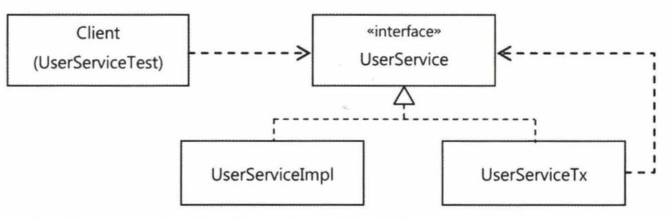

Reference Book : [토비의 스프링 3.1](http://acornpub.co.kr/book/toby-spring3-1-vol2), 이일민, 에이콘 출판사

[Spring Study - (4)](../16)

---

## AOP

AOP(Aspect Oriented Programming)는 DI/IoC와 서비스 추상화와 함께 스프링에서 제공하는 3가지 핵심 기술 중 하나이다. 스프링이 굳이 난해한 AOP를 도입한 이유를 알아보자. 

### 트랜잭션 코드의 분리

서비스 추상화를 통해 트랜잭션 기술에 독립적인 코드를 만들어왔지만 경계설정 부분은 여전히 찜찜하다.

```java
public void upgradeLevels() throws Exception {
	TransactionStatus status = this.transactionManager.getTransaction(new DefaultTransactionDefinition());
	
	try {
		// ------- 비즈니스 로직 --------
		List<User> users = userDao.getAll();
		for(User user : users) {
			if(canUpgradeLevel(user)) {
				upgradeLevel(user);
			}
		}
		// ---------------------------
		this.transactionManager.commit(status);
	} catch (RuntimeException e) {
		this.transactionManager.rollback(status);
		throw e;
	}
}
```

분명히 레벨업을 시켜주는 메소드인데 트랜잭션 설정에 관련된 코드가 더 많다. 그렇다고 트랜잭션 설정의 위치를 변경하는 것도 불가능하다. 일단은 트랜잭션 관련 코드와 비즈니스 로직 코드를 분리시켜보자.

```java
public void upgradeLevels() throws Exception {
	TransactionStatus status = this.transactionManager.getTransaction(new DefaultTransactionDefinition());
	
	try {
		upgradeLevelsInternal();
		this.transactionManager.commit(status);
	} catch (RuntimeException e) {
		this.transactionManager.rollback(status);
		throw e;
	}
}

private void upgradeLevelsInternal() {
	List<User> users = userDao.getAll();
	for(User user : users) {
		if(canUpgradeLevel(user)) {
			upgradeLevel(user);
		}
	}
}
```

트랜잭션 코드는 꼭 필요하긴 하지만, 이렇게 분리시켜보면 사실 다른 부분과 정보를 주고 받는 것이 없다. 그렇다면 클래스 밖으로 이 코드를 뽑아내는 것이 가능하지도 않을까? 



이런 경우에 인터페이스를 활용하여 트랜잭션 코드와 비즈니스 로직을 분리할 수 있다. 위 이미지와 같이 기존 UserService에서 직접 로직을 구현하지 않고 인터페이스로 만든 다음, 실제 구현체들을 트랜잭션과 비즈니스 로직 두개의 클래스로 구현하는 방식이다.

```java
public interface UserService {
	public void add(User user);
	public void upgradeLevels();
}
```

```java
public class UserServiceImpl {
	UserDAO userDao;
	MailSender mailSender;
	
	public void upgradeLevels() {
		List<User> users = userDao.getAll();
		for(User user : users) {
			if(canUpgradeLevel(user)) {
				upgradeLevel(user);
			}
		}
	}
	...
```

트랜잭션 관련 코드를 넣기 전 레벨업 기능을 구현했던 모습으로 그대로 돌아왔다. 이 코드는 유저 레벨업 관련 동작만 수행하는 비즈니스 로직에 충실한 코드다. 이제 트랜잭션 처리를 담은 구현체를 만들어야 한다.

```java
public class UserServiceTx implements UserService {
	UserService userService;
	
	public void setUserService(UserService userService) {
		this.userService = userService;
	}

	public void add(User user) {
		userService.add(user);
	}

	public void upgradeLevels() {
		userService.upgradeLevels();
	}

}
```

트랜잭션 처리 구현체는 다른 UserService 구현체 오브젝트를 DI 받아 모든 기능을 위임해서 동작하는 구조로 되어있다. 이 구조 위에 트랜잭션 경계설정이라는 부가적인 작업을 붙여보자.

```java
public class UserServiceTx implements UserService {
	UserService userService;
	PlatformTransactionManager transactionManager;
	
	public void setUserService(UserService userService) {
		this.userService = userService;
	}
	
	public void setTransactionManager(PlatformTransactionManager transactionManager) {
		this.transactionManager = transactionManager;
	}

	public void add(User user) {
		userService.add(user);
	}

	public void upgradeLevels() {
		TransactionStatus status = this.transactionManager.getTransaction(new DefaultTransactionDefinition());
		try {
			userService.upgradeLevels();
			
			this.transactionManager.commit(status);
		} catch (RuntimeException e) {
			this.transactionManager.rollback(status);
			throw e;
		}
	}
}
```

이제 설정 파일을 수정해야 한다. 트랜잭션 구현체가 비즈니스 로직 구현체를 의존하는 구조로 되어 있으니 Client -> UserServiceTx -> UserServiceImpl 순으로 의존하도록 프로퍼티 정보를 분리한다.

```xml
<bean id="userService" class="tobi.user.dao.UserServiceTx">
	<property name="transactionManager" ref="transactionManager" />
	<property name="userService" ref="userServiceImpl" />
</bean>

<bean id="userServiceImpl" class="tobi.user.dao.UserServiceImpl">
	<property name="userDao" ref="userDao" />
	<property name="mailSender" ref="mailSender" />
</bean>
```

테스트코드에서는 *@Autowired*로 UserService를 주입받아 사용하고 있다. 하지만 UserService가 인터페이스로 변경되고, 그 타입의 빈이 2개나 되는 상황에서는 어떤 UserService 빈을 사용해야 할지 모르는 상태가 된다. 이럴땐 id가 userService인 빈이 자동으로 선택돼 주입된다. 이제 클라이언트 입장에서는 UserService에 대해 자세히 모르는 상태에서 인터페이스만 알고있고 컨테이너가 지정해준 빈을 주입받아 사용하는 것이다.

일반적인 코드는 인터페이스만으로 충분할텐데 테스트코드는 Mock 객체를 생성해야해서 별도로 UserServiceImpl 구현체의 빈을 가져와야한다. 또한 기존 테스트 코드는 UserService를 바로 상속하고 있었지만, UserServiceImpl를 상속하도록 변경해야 한다. 

```java
@Autowired
UserServiceImpl userServiceImpl;

@Test
@DirtiesContext
public void upgradeLevels() throws Exception {
	userDao.deleteAll();
	for(User user : users) {
		userDao.add(user);
	}
	
	MockMailSender mockMailSender = new MockMailSender();
	userServiceImpl.setMailSender(mockMailSender);
	
	userServiceImpl.upgradeLevels();
	...
}

upgradeAllOrNothing() 메소드는 트랜잭션 처리를 테스트하기 위한 테스트 메소드였으니, 바뀐 형태로 레벨업 메소드를 수행하도록 수정해준다.

@Test
public void upgradeAllOrNothing() throws Exception {
	TestUserService testUserService = new TestUserService(users.get(3).getId());
	testUserService.setUserDao(this.userDao);
	testUserService.setMailSender(this.mailSender);
	
	UserServiceTx txUserService = new UserServiceTx();
	txUserService.setTransactionManager(this.transactionManager);
	txUserService.setUserService(testUserService);
	
	userDao.deleteAll();
	for(User user : users) {
		userDao.add(user);
	}
	
	try {
		txUserService.upgradeLevels();
		fail("TestUserServiceException expected");
	} 
	catch (TestUserServiceException e) {
	}
	
	checkLevelUpgraded(users.get(1), false);
}
```

이제 비즈니스 로직과 트랜잭션 처리가 완전히 분리되어 UserService 구현체에만 신경쓰면 되는 구조가 되어, 트랜잭션 같은 복잡한 기술을 잘 모르는 사람도 비즈니스 로직만 잘 이해한다면 UserService를 사용하는 것이 가능해졌다.

---

### 고립된 단위 테스트

가장 좋은 테스트 방법은 <U>가능한 작은 단위로 쪼개서 테스트</U>하는 것이다. 테스트 단위를 최대한 잘게 쪼개야 어느 부분에서 에러가 발생했는지 쉽게 파악할 수 있다. 하지만 테스트 대상이 다른 오브젝트에 의존하고 있는 구조가 많아, 테스트 단위를 작게 나누는 것이 쉽지만은 않다.

UserService의 예제를 생각해봐도 사실 UserServic는 JDBC를 이용한 UserDAO, MailSender 등에 의존하고 있다. 우리의 코드만 테스트하는 것처럼 보이지만 사실 그 뒤의 더 많은 오브젝트, 서버, DB, 네트워크와 함께 테스트하고 있는 것이다. DB서버가 다운되거나, 누군가 UserDAO를 건드려서 UserService의 테스트가 실패하게 될 수도 있다. 

그래서 테스트 대상이 주변에 영향 받지 않도록 고립시켜야 한다. 그 방법은 MailSender 에서도 사용했던 테스트용 Mock 오브젝트를 사용하는 것이다.

* UserServiceImpl의 고립된 단위 테스트 만들기

UserService에서는 User 목록 조회와 업데이트를 위해 UserDAO 객체를 주입받아 사용한다. UserServiceTest가 UserDAO에 영향받지 않게 하기 위해 테스트를 위한 UserDAO의 Mock 객체가 필요하다.

```java
public class MockUserDAO implements UserDAO {
	private List<User> user;
	private List<User> updated = new ArrayList();
	
	public MockUserDAO(List<User> user) {
		this.user = user;
	}
	
	public List<User> getUpdated() {
		return this.updated;
	}
	
	@Override
	public List<User> getAll() {
		return this.user;
	}

	@Override
	public void update(User user) {
		updated.add(user);
	}
	...
```

```java
@Test
@DirtiesContext
public void upgradeLevels() throws Exception {
	UserServiceImpl userServiceImpl = new UserServiceImpl();
	
	MockUserDAO mockUserDao = new MockUserDAO(this.users);
	userServiceImpl.setUserDao(mockUserDao);
	
	MockMailSender mockMailSender = new MockMailSender();
	userServiceImpl.setMailSender(mockMailSender);
	
	userServiceImpl.upgradeLevels();
	
	List<User> updated = mockUserDao.getUpdated();
	assertThat(updated.size(), is(2));
	checkUserAndLevel(updated.get(0), "U2", Level.SILVER);
	checkUserAndLevel(updated.get(1), "U4", Level.GOLD);
	
	List<String> request = mockMailSender.getRequest();
	assertThat(request.size(), is(2)); // 레벨업 대상이 2명이라 메일 전송도 2번 예상됨
	assertThat(request.get(0), is(users.get(1).getEmail()));
	assertThat(request.get(1), is(users.get(3).getEmail()));
}
```

원래 UserDAO는 DB에서의 CRUD를 처리하지만 UserService의 레벨업 처리를 테스트만 할 것이라면 사실 DB까지 필요하지 않다. 대강 업데이트를 체크할 수 있는 List를 갖는 Mock 객체로 테스트 내의 UserDAO를 대체해도 무방하다.

### 단위 테스트와 통합 테스트

>단위 테스트 : Mock 오브젝트를 통해 독립적으로 수행되는 테스트  
>통합 테스트 : DB나 외부 서버 등의 리소스가 필요한 테스트

* 항상 단위 테스트가 가능한지 우선적으로 고려

* 단위 테스트를 만들기 어려운 코드(DAO가 대표적)는 통합 테스트로. 대신 이런 경우에는 테스트를 위한 DB 데이터를 별도로 준비해두는게 좋다

* DAO는 통합 테스트로 만들더라도, DAO를 사용하는 코드는 Mock 오브젝트를 활용해 단위 테스트로 만들 수 있다

* 의존 관계가 복잡하게 연결돼있다면 통합 테스트도 반드시 필요하다

### Mock 프레임워크

Mock 오브젝트 생성을 도와주는 프레임워크. <b>Mockito</b> 라는 프레임워크가 인기가 많다. 간단한 메소드 호출만으로 <U>특정 인터페이스를 구현한 테스트용 오브젝트</U>를 만들 수 있다.

Mockito 오브젝트는 다음 네 단계를 거쳐서 사용한다.

* 인터페이스를 이용해 목 오브젝트를 만든다

* 리턴할 값이 있으면 이를 지정해준다

* 테스트 대상 오브젝트에 DI해서 목 오브젝트가 테스트 중에 사용되도록 만든다

* 목 오브젝트의 특정 메소드가 호출됐는지, 어떤 값을 가지고 몇 번 호출 됐는지 검증한다.

```java
// Mock 오브젝트 생성
UserDAO mockUserDao = mock(UserDAO.class);
// Mock 기능 추가 - 특정 메소드가 불릴 때 리턴해줄 대상을 결정
when(mockUserDao.getAll()).thenReturn(this.users);
// Mock 검증
verify(mockUserDao, times(2)).update(any(User.class));
```

> 뭐 이런것도 있다고 알아두고 넘어간다

### 프록시 패턴 & 다이내믹 프록시

[프록시 패턴](../12)은 클라이언트가 타깃에 접근하는 방식을 변경해준다. 타깃 오브젝트가 당장 필요하지 않은 경우는 생성되지 않은 상태일 수 있는데, 클라이언트는 이때도 타깃에 대한 레퍼런스가 필요할 수는 있다. 이 경우 실제 타깃 오브젝트 대신 프록시를 넘겨주는 식으로 프록시 패턴이 사용된다. 혹은 접근권한 관리 같은 부가 기능을 수행할 수도 있다.  
프록시는 다음의 두 가지 기능으로 구성된다.

* 타깃과 같은 메소드를 구현하고 있다가 메소드가 호출되면 타깃 오브젝트로 위임한다
* 지정된 요청에 대해서는 부가기능을 수해한다.

트랜잭션 부가기능을 위해 만든 UserServiceTx가 바로 프록시다. 

```java
public class UserServiceTx implements UserService {
	...

	public void add(User user) {
		// 호출은 먼저 UserServiceTx(프록시)에서 받고
		userService.add(user); // 타깃 오브젝트인 userService로 위임
	}

	public void upgradeLevels() {
		// 프록시에서 부가기능(Transaction 관련) 수행 후
		TransactionStatus status = this.transactionManager.getTransaction(new DefaultTransactionDefinition());
		try {
			userService.upgradeLevels(); // 타깃 오브젝트로 위임
			
			this.transactionManager.commit(status);
		} catch (RuntimeException e) {
			this.transactionManager.rollback(status);
			throw e;
		}
	}
```

하지만 사실 일일이 프록시를 만들기는 번거롭다. *add()* 같은 경우에는 별 부가기능이 없더라도 따로 메소드를 새로 만들어서 위임시켜줘야하고, 부가기능 구현시 중복코드 발생이 가능성이 높아진다. *add()* 메소드도 트랜잭션이 필요한 상황이 온다면? *upgradeLevels()*에 있는 트랜잭션 처리 코드가 중복해서 나타나게 될 것이다.

JDK의 다이내믹 프록시는 [리플렉션](../java-study-1) 기능을 이용해서 프록시를 만들어준다.

* Transaction InvocationHandler

```java
public class TransactionHandler implements InvocationHandler {
	
	private Object target; // 부가기능을 제공할 타깃 오브젝트
	private PlatformTransactionManager transactionManager;
	private String pattern; // 트랜잭션을 적용할 메소드 이름 패턴

	public void setTarget(Object target) {
		this.target = target;
	}
	
	public void setTransactionManager(PlatformTransactionManager transactionManager) {
		this.transactionManager = transactionManager;
	}
	
	public void setPattern(String pattern) {
		this.pattern = pattern;
	}
	
	@Override
	public Object invoke(Object proxy, Method method, Object[] args) throws Throwable {
		if(method.getName().startsWith(pattern)) {
			return invokeInTransaction(method, args);
		}
		else {
			return method.invoke(target, args);
		}
	}
	
	private Object invokeInTransaction(Method method, Object[] args) throws Throwable {
		TransactionStatus status = this.transactionManager.getTransaction(new DefaultTransactionDefinition());
		try {
			Object ret = method.invoke(target, args);
			this.transactionManager.commit(status);
			return ret;
		} catch (InvocationTargetException e) {
			this.transactionManager.rollback(status);
			throw e.getTargetException();
		}
	}
}
```

메소드의 형태는 UserServiceTx에서 트랜잭션을 처리할때와 동일하지만, 수행될 타깃 메소드를 주입받아서 사용하도록 되어있다. 주입된 메소드 이름이 특정 패턴을 만족한다면 트랜잭션 처리를 위해 위임하고, 아니면 그대로 수행한다.

```java
@Test
public void upgradeAllOrNothing() throws Exception {
	...

	TransactionHandler txHandler = new TransactionHandler();
	txHandler.setTarget(testUserService);
	txHandler.setTransactionManager(transactionManager);
	txHandler.setPattern("upgradeLevels");
	
	//UserServiceTx txUserService = new UserServiceTx();
	//txUserService.setTransactionManager(this.transactionManager);
	//txUserService.setUserService(testUserService);
	
	//UserServiceTx 대신 트랜잭션용 프록시로 대체
	UserService txUserService = (UserService) Proxy.newProxyInstance(
			getClass().getClassLoader(), 
			new Class[] { UserService.class },  
			txHandler);
	...
```

클라이언트에서 사용할 때는 기존에 서비스별로 따로 만들었던 트랜잭션 구현체 대신 프록시로 대체한다.

### 다이내믹 프록시를 위한 팩토리 빈

TransactionHandler가 제대로 동작하는 것을 확인했으니, 이제 빈으로 등록해서 DI를 통해 사용할 수 있도록 만들어야 한다. 하지만 TransactionHandler는 일반적인 빈처럼 설정파일로 등록할 수가 없다. 설정으로 프로퍼티가 지정되어야 하는데, 타깃 오브젝트는 런타임에 타입이 정해지기 때문에 미리 설정해두는 것이 불가능하다. 

스프링에서는 빈을 생성할 수 있는 방법이 여러가지 존재하는데, 그 중 하나가 **팩토리 빈**을 통해 생성하는 것이다. 팩토리 빈은 <U>빈을 등록해주는 빈</U>이라고 생각하면 된다. 

스프링 빈에는 팩토리 빈과 UserServiceImpl만 빈으로 등록된다. 팩토리 빈은 UserServiceImpl에 대한 레퍼런스를 프로퍼티를 통해 DI 받아둬야 한다. TransactionHandler에게 타깃 오브젝트를 전달해줘야 하기 때문이다. 그 외에도 다이내믹 프록시나 TransactionHandler를 구성하기 위한 정보는 미리 팩토리 빈의 프로퍼티로 등록해둬야 한다.

```java
public class TxProxyFactoryBean implements FactoryBean<Object> {
	Object target;
	PlatformTransactionManager transactionManager;
	String pattern;
	Class<?> serviceInterface;

	public void setTarget(Object target) {
		this.target = target;
	}

	public void setTransactionManager(PlatformTransactionManager transactionManager) {
		this.transactionManager = transactionManager;
	}

	public void setPattern(String pattern) {
		this.pattern = pattern;
	}

	public void setServiceInterface(Class<?> serviceInterface) {
		this.serviceInterface = serviceInterface;
	}
	
	@Override
	public Object getObject() throws Exception {
		TransactionHandler txHandler = new TransactionHandler();
		txHandler.setTarget(target);
		txHandler.setTransactionManager(transactionManager);
		txHandler.setPattern(pattern);
		return Proxy.newProxyInstance(
				getClass().getClassLoader(), 
				new Class[] {serviceInterface},
				txHandler
		);
	}

	@Override
	public Class<?> getObjectType() {
		return serviceInterface;
	}
	
	public boolean isSingleton() {
		return false; // 싱글톤 빈이 아니라 getObject()가 매번 같은 오브젝트를 리턴하지 않는다는 의미
	}
}
```

이제 빈 설정에 UserServiceTx 대신 팩토리 빈을 등록해줘야 한다.

```xml
<bean id="userService" class="tobi.user.service.TxProxyFactoryBean">
	<property name="transactionManager" ref="transactionManager" />
	<property name="target" ref="userServiceImpl" />
	<property name="pattern" value="upgradeLevels" />
	<property name="serviceInterface" value="tobi.user.service.UserService" />
</bean>
```
(upgradeLevels, UserService는 다른 빈을 가리키는게 아니라 String 값이나 Class 타입이기 때문에 value로 넣어준다)

```java
@Test
@DirtiesContext
public void upgradeAllOrNothing() throws Exception {
	TestUserService testUserService = new TestUserService(users.get(3).getId());
	testUserService.setUserDao(this.userDao);
	testUserService.setMailSender(this.mailSender);
	
	TxProxyFactoryBean txProxyFactoryBean = context.getBean("&userService", TxProxyFactoryBean.class);
	txProxyFactoryBean.setTarget(testUserService);
	UserService txUserService = (UserService) txProxyFactoryBean.getObject();

	...
```
*context.getBean("&userService", TxProxyFactoryBean.class)* 에서 **&userService**의 ```&```는 userService 빈이 아니라 userService의 팩토리 빈을 나타낸다.

### 프록시 팩토리 빈의 재사용

프록시 팩토리 빈은 코드 수정 없이 프로퍼티 설정으로 빈을 등록해주기만 하면 다양한 클래스에 적용이 가능하다. 

```xml
<bean id="coreService" class="tobi.user.service.TxProxyFactoryBean">
	<property name="transactionManager" ref="transactionManager" />
	<property name="target" ref="coreServiceTarget" />
	<property name="pattern" value="" />
	<property name="serviceInterface" value="xxx.coreService" />
</bean>
```

위와 같이 target과 serviceInterface만 주입해주면 coreService라는 아이디를 가진 빈을 DI 받아 사용하는 클라이언트는 별도의 구현없이 트랜잭션 기능이 적용된 CoreService를 이용할 수 있게된다.

하지만 동시에 프록시 팩토리 빈의 한계도 보인다. 프록시를 통해 타깃에 부가기능을 제공하는 것은 클래스가 아닌 메소드 단위로 일어나기 때문에 동시에 여러 클래스에 공통적인 기능을 적용시키는 것이 불가능하고, 반대로 하나의 클래스에 여러 부가기능을 부여하는 것도 불가능하다. 따라서 *클래스하나, 부가기능 하나마다 XML 설정을 새로 만들어줘야해서*, 역으로 설정 파일 관리가 어려워진다는 새로운 문제가 생겼다.

## 스프링의 프록시 팩토리 빈

### Advice & Pointcut

스프링의 ProxyFactoryBean은 프록시를 생성해서 빈 오브젝트로 등록하게 해주는 팩토리 빈이다. 부가기능은 ```MethodInterceptor``` 인터페이스를 구현해서 만든다. 스프링은 메소드 실행을 가로채는 방식 이외에도 부가기능을 추가하는 방법을 제공하고 있다. *MethodInterceptor* 처럼 타깃 오브젝트에 적용하는 부가기능을 담은 오브젝트를 스프링에서는 ```어드바이스Advice```라고 부른다. 

> Advice는 타깃 오브젝트에 종속되지 않는 순수한 부가기능을 담은 오브젝트다

JDK에서 부가기능 적용 대상 메소드를 선정하는 것은 pattern이라는 메소드 이름 비교용 스트링을 DI 받아 판단했다. 스프링에서는 이것을 담당하는 오브젝트도 빈으로 등록되어 사용이 가능하다. 이 오브젝트를 포인트 컷이라고 한다.

> Pointcut은 부가기능이 적용될 메소드 선정 알고리즘을 담은 오브젝트다

포인트컷이 필요 없을 때는 addAdvice()로 어드바이스만 호출하면 됐지만, 포인트컷을 함께 등록할 때는 어드바이스와 포인트컷을 Advisor 타입으로 묶어서 addAdvisor()를 호출해야한다.

> Advisor = Poincut + Advice

### ProxyFactoryBean 적용

*TxProxyFactoryBean*을 스프링이 제공하는 *ProxyFactoryBean*을 이용해서 수정해보자

* TransactionAdvice

```java
public class TransactionAdvice implements MethodInterceptor {
	PlatformTransactionManager transactionManager;
	
	public void setTransactionManager(PlatformTransactionManager transactionManager) {
		this.transactionManager = transactionManager;
	}

	@Override
	public Object invoke(MethodInvocation invocation) throws Throwable {
		TransactionStatus status = this.transactionManager.getTransaction(new DefaultTransactionDefinition());
		
		try {
			// Callback 호출로 타깃의 메소드 실행 
			Object ret = invocation.proceed();
			this.transactionManager.commit(status);
			return ret;
		} catch (RuntimeException e) {
			this.transactionManager.rollback(status);
			throw e;
		}
	}
}
```

* XML 설정

설정파일에서 property 설정으로 간단하게 포인트컷이나 어드바이스를 재사용하는 것이 가능

```xml
<bean id="transactionAdvice" class="tobi.user.service.TransactionAdvice">
	<property name="transactionManager" ref="transactionManager" />
</bean>

<bean id="transactionPointcut" class="org.springframework.aop.support.NameMatchMethodPointcut">
	<property name="mappedName" value="upgrade*"/>
</bean>

<bean id="transactionAdvisor" class="org.springframework.aop.support.DefaultPointcutAdvisor">
	<property name="advice" ref="transactionAdvice" />
	<property name="pointcut" ref="transactionPointcut" />
</bean>


<bean id="userService" class="org.springframework.aop.framework.ProxyFactoryBean">
	<property name="target" ref="userServiceImpl" />
	<property name="interceptorNames">
		<list>
			<value>transactionAdvisor</value>
		</list>
	</property>
</bean>
```

* 테스트 코드

트랜잭션이 적용됐는지를 테스트하는 부분이 중요

```java
@Test
@DirtiesContext
public void upgradeAllOrNothing() throws Exception {
	...
	//TxProxyFactoryBean txProxyFactoryBean = context.getBean("&userService", TxProxyFactoryBean.class); ==>
	ProxyFactoryBean txProxyFactoryBean = context.getBean("&userService", ProxyFactoryBean.class);
	txProxyFactoryBean.setTarget(testUserService);
	UserService txUserService = (UserService) txProxyFactoryBean.getObject();
	...
}
```

