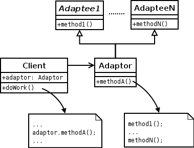

## 시작

Reference Book : [Java 언어로 배우는 디자인 패턴 입문](https://www.youngjin.com/book/book_detail.asp?prod_cd=9788931436914&seq=4628&cate_cd=1&child_cate_cd=&goPage=11&orderByCd=3), Yuki Hiroshi, 영진닷컴

## 추상적으로

디자인패턴은 객체간의 결합을 느슨하게 만들어 재사용성 높은 코드를 만들게 하는 기법으로, *목표가 아닌 수단일 뿐이다*.  
무조건 내부 구현체를 만드는게 아니라, 추상적으로 구조를 생각해야한다.

---

### Iterator 패턴

> '무엇인가 많이 모여있는(Aggregate)' 것들을 사용해 '반복적으로(Iterate)' 동작을 수행하게 하는 패턴.  

Aggregate의 형태에 영향받지 않고 동일한 방식으로 Iteration을 수행하게 하는 것이 목표다.


* Aggregate 인터페이스

어떤 요소들이 나열되어 있는 '집합체'

```java
public interface Aggregate {
    public Iterator iterator();
}
```

Aggregate 에는 iterator 메소드 1개만 선언되어 있다. 집합체를 나열하거나 조사하고 싶을때 iterator 메소드로 Iterator 인스턴스를 하나 생성해서 사용한다.

* Iterator 인터페이스

특정 요소들을 반복하기 위한 메소드들

```java
public interface Iterator {
    public boolean hasNext();
    public Object next();
}
```

hasNext() 메소드로 다음 요소가 남아있는지 확인하고, 남아있다면 next() 메소드로 그 요소를 얻는다.

#### Example - BookShelf

서가(BookShelf) 안에 책(Book) 을 넣고, 책들의 이름을 차례로 표시하는 프로그램

* BookShelf는 Book들이 모여있는 것, 즉 Book의 Aggregate다. - BookShelf는 Aggregate Interface의 구현체가 된다.
* BookShelf에서 사용할 Iterator의 구현체(BookShelfIterator)도 필요하다.

```java
public class BookShelf implements Aggregate {
    private Book[] books;
    private int last = 0;

    public BookShelf(int maxsize) {
        this.books = new Book[maxsize];
    }

    public Book getBookAt(int index) {
        return books[index];
    }

    public void appendBook(Book book) {
        this.books[last] = book;
        last++;
    }

    public int getLen() {
        return last;
    }

    @Override
    public Iterator iterator() {
        return new BookShelfIterator(this);
    }
}
```

```java
public class BookShelfIterator implements Iterator {
    private BookShelf bookShelf;
    private int index;
    
    public BookShelfIterator(BookShelf bookShelf) {
        this.bookShelf = bookShelf;
        this.index = 0;
    }

    @Override
    public boolean hasNext() {
        return ( index < bookShelf.getLen() );
    }

    @Override
    public Object next() {
        Book book = bookShelf.getBookAt(index);
        index++;
        return book;
    }
}
```

```java
public class Main {
    public static void main(String[] args) {
        BookShelf bookShelf = new BookShelf(4);
        bookShelf.appendBook(new Book("ABCD"));
        bookShelf.appendBook(new Book("Hello"));
        bookShelf.appendBook(new Book("바이블"));
        bookShelf.appendBook(new Book("가나다라"));

        Iterator it = bookShelf.iterator();

        while(it.hasNext()) {
            Book book = (Book) it.next();
            System.out.println(book.getName());
        }
    }
}
```

#### 왜?

Iterator를 사용함으로써 *while 루프를 BookShelf의 구현과 분리시킬 수 있다.*  
예제의 경우 배열을 사용해서 BookShelf를 구현했지만 나중에 List나 Vector로 구현이 변경될 수도 있다. 만약 구현이 분리되지 않았다면 *BookShelf는 물론이고 while 루프까지 수정해야 했겠지만*, <b>구현을 분리함으로써 BookShelf만 수정하면 되는 것</b>이다.

#### 연습문제

BookShelf 내부의 books를 배열이 아닌 <b>ArrayList</b>를 사용해서 구현

```java
import java.util.List;
import java.util.ArrayList;

public class BookShelf implements Aggregate {
    private List<Book> books;

    public BookShelf() {
        this.books = new ArrayList<>();
    }

    public Book getBookAt(int index) {
        return books.get(index);
    }

    public void appendBook(Book book) {
        books.add(book);
    }

    public int getLen() {
        return books.size();
    }

    @Override
    public Iterator iterator() {
        return new BookShelfIterator(this);
    }
}
```

BookShelf의 구현체 내에서 배열을 ArrayList로 수정했지만, 다른 코드에는 영향을 *크게* 주지 않는다. (배열의 경우 Main에서 배열 사이즈를 정해줘야하는데 ArrayList로 구현하면 빼줘야하는 변경점은 있다..)

### Adaptor 패턴

> 무엇인가를 포장해서 다른 용도로 사용할 수 있게 교환해주는 패턴.  

*기존 객체*를 <b>*원하는 형식*</b>으로 바꾸어(Adapt) 사용하는 방식.  
Adaptor 패턴에는 두 가지 종류가 있다. - <b>클래스에 의한 (상속)</b> / <b>인스턴스에 의한 (위임)</b>

#### Example - Banner

주어진 문자열 <b>Hello</b>를 <b>(Hello)</b>, <b>\*Hello\*</b> 처럼 바꿔주는 프로그램

* Banner(문자열을 바꿔주는 클래스) 클래스에는 괄호로 묶어주는 showWithParen() 메소드와 *로 묶어주는 showWithAster() 메소드가 있다
* Print 인터페이스에는 문자열이 부가설명이라는 것을 표현하기 위한 printWeak() 메소드와 강조를 표현하기 위한 printStrong() 메소드가 선언되어 있다.
* 부가설명은 ()로 표현할 수도 있고 {}로 표현할 수도 있다. 강조도 \*로 표현할 수도 있고 $로 표현할 수도 있다. 중요한건 *인터페이스에 어떤 구현체를 갖다 붙여주냐*이다.
* PrintBanner 클래스가 Adaptor 역할을 한다. <b>showWithParen() 으로 printWeak을 구현</b>하고 <b>showWithAster() 로 printStrong을 구현</b> 한다.

```java
public class Main {
    public static void main(String[] args) {
        Print p = new PrintBanner("Hello world");
        p.printWeak();
        p.printStrong();
    }
}
```

```java
public class Banner {
    private String str;
    
    public Banner(String str) {
        this.str = str;
    }

    public void showWithParen() {
        System.out.println("(" + str + ")");
    }

    public void showWithAster() {
        System.out.println("*" + str + "*");
    }
}
```

PrintBanner 내부에서 어댑터가 어떤 식으로 동작해서 "Hello World" 문자열을 바꿔주는건지는 사용하는 입장(Main)에서는 알 필요가 없다. printWeak, printStrong 함수가 잘 호출되기만 하면 될 뿐이다.  
printWeak, printStrong이 어떻게 동작할지는 구현된 어댑터에 달려있다.



상속 형태의 어댑터

```java
public interface Print {
    public void printWeak();
    public void printStrong();
}
```

```java
public class PrintBanner extends Banner implements Print {
    public PrintBanner(String str) {
        super(str);
    }

    @Override
    public void printWeak() {
        showWithParen();
    }

    @Override
    public void printStrong() {
        showWithAster();
    }
}
```

Banner를 상속 받아서 구현


위임 형태의 어댑터

```java
public abstract class Print {
    public abstract void printWeak();
    public abstract void printStrong();
}
```

```java
public class PrintBanner extends Print {
    private Banner banner;

    public PrintBanner(String str) {
        this.banner = new Banner(str);
    }

    @Override
    public void printWeak() {
        banner.showWithParen();
    }

    @Override
    public void printStrong() {
        banner.showWithAster();
    }
}
```

Banner를 상속받는게 아니라 인스턴스로 만들어, 메소드를 스스로 호출하는게 아니라 Banner 인스턴스가 호출하도록 위임

<b>Adaptor를 포장이라는 관점에서 보면</b>

* Client

포장된 무엇인가를 사용하는 주체 (Main)

* Target

포장된 무엇인가를 사용하기 위한 메소드 (Print)

* Adaptee

포장될 대상 (Banner)

* Adaptor

포장지 (PrintBanner)

#### 연습문제

```java
import java.io.IOException;

public class Main {
    public static void main(String[] args) {
        FileIO f = new FileProperties();
        try {
            f.readFromFile("file.txt");
            f.setValue("month", "4");
            f.setValue("day", "21");
            f.writeToFile("newfile.txt");
        } catch (IOException e) {
            e.printStackTrace();
        }
    }
}
```

```java
import java.io.IOException;

public interface FileIO {
    public void readFromFile(String filename) throws IOException;
    public void writeToFile(String filename) throws IOException;
    public void setValue(String key, String value);
    public String getValue(String key);
}
```

위와 같이 FileIO는 key, value 로 값이 주어지면 그 값들을 저장하여 File I/O를 수행해주는 역할을 하는 인터페이스이다. key, value를 java.util.Properties 객체로 관리하는 FileIO 구현체를 만들어라.

* 문제는 Properties를 사용해서 구현하도록 되어있지만, 사실 Main은 FileIO 구현체가 Properties건, Hashtable이건, HashMap이건 영향받지 않아야한다. Main은 FileIO 인터페이스의 메소드만 호출할 뿐이고 그 메소드 구현은 Adaptor(FileProperties)에 달려있다.

```java
import java.util.Properties;
import java.io.*;

public class FileProperties implements FileIO {
    Properties properties;

    public FileProperties() {
        properties = new Properties();
    }

    public void readFromFile(String filename) throws IOException {
        File file = new File(filename);
        FileReader filereader = new FileReader(file);

        properties.load(filereader);
    }

    public void writeToFile(String filename) throws IOException {
        File file = new File(filename);
        FileWriter filewriter = new FileWriter(file);

        properties.store(filewriter, "Written by FileProperties");
    }

    public void setValue(String key, String value) {
        properties.setProperty(key, value);
    }

    public String getValue(String key) {
        return properties.getProperty(key);
    }
}
```

* 아무 생각없없는데 나중에 보니 홈페이지의 풀이는 '상속' 방식으로 구현해놨고 나는 '위임' 방식으로 풀어놨더라.  
* 또 만들어놓고 보니 '위임' 방식은 생긴게 마치 Spring에서 bean을 주입받아 쓰는 것과 비슷한 형태를 하고 있다. 물론 여기서는 properties를 주입받아 쓰고 있지는 않지만 Spring이었다면 (@Autowired Properties properties;) 같은 형태로 주입받아서 쓸 수 있지 않았을까..  
* 이런식으로 코드가 개선되기 위해서는 역시 상속 보다는 위임 형태로 하는게 맞았던 것 같다. 상속을 피하라는게 무슨 의미인지 약간은 알 것 같다. 부모 클래스의 파라미터를 수정하면 자식 클래스의 생성자에서도 super 호출 부분을 수정해야했을테니

---

## Image Reference

https://zetawiki.com/wiki/Java_%EC%96%B8%EC%96%B4%EB%A1%9C_%EB%B0%B0%EC%9A%B0%EB%8A%94_%EB%94%94%EC%9E%90%EC%9D%B8_%ED%8C%A8%ED%84%B4_%EC%9E%85%EB%AC%B8