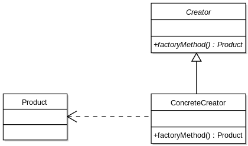

Reference Book : [Java 언어로 배우는 디자인 패턴 입문](https://www.youngjin.com/book/book_detail.asp?prod_cd=9788931436914&seq=4628&cate_cd=1&child_cate_cd=&goPage=11&orderByCd=3), Yuki Hiroshi, 영진닷컴

---

### Template method 패턴

> 어떤 알고리즘에 대한 큰 틀이 결정된 상태에서 구체적인 설계를 서브클래스에 맡기는 디자인 패턴

상위 클래스에서 템플릿에 해당하는 메소드가 정의되어 있고, 그 메소드에서는 추상 메소드가 사용된다.  
하위 클래스는 상위 추상 클래스를 상속받아 추상 메소드를 구현한다.  
상위 클래스는 큰 흐름만 결정하고, 구체적인 동작은 하위 클래스가 수행한다.

#### Example - 5회 출력하기

무엇을 5회 출력? -> '무엇' : 하위 클래스에 정의 / 5회 출력 : 상위 클래스에서 정의

```java
public abstract class AbstractDisplay {
    public abstract void open();
    public abstract void print();
    public abstract void close();
    public final void display() {
        // 선언만 되고 아직 정의되지 않은 추상 메소드들을 사용
        open();
        for(int i = 0; i < 5; i++) {
            print();
        }
        close();
    }
}
```

상위 클래스로 AbstractDisplay 추상 클래스가 정의됐고, 이 추상 클래스를 상속 받아 구체적인 동작을 구현하는 하위 클래스가 필요하다.

```java
public class StringDisplay extends AbstractDisplay {
    private String str;
    private int strLen;

    public StringDisplay(String str) {
        this.str = str;
        this.strLen = str.length();
    }
    
    public void open() {
        printLine();
    }
    public void close() {
        printLine();
    }
    public void print() {
        System.out.println("|" + str + "|");
    }
    private void printLine() {
        StringBuilder sb = new StringBuilder();
        sb.append("+");
        for(int i = 0; i < strLen; i++) 
            sb.append("-");
        sb.append("+");
        System.out.println(sb.toString());
    }
}
```

*Char*를 5회 출력하도록 구현된 하위 클래스

```java
public class StringDisplay extends AbstractDisplay {
    private String str;
    private int strLen;

    public StringDisplay(String str) {
        this.str = str;
        this.strLen = str.length();
    }
    
    public void open() {
        printLine();
    }
    public void close() {
        printLine();
    }
    public void print() {
        System.out.println("|" + str + "|");
    }
    private void printLine() {
        StringBuilder sb = new StringBuilder();
        sb.append("+");
        for(int i = 0; i < strLen; i++) 
            sb.append("-");
        sb.append("+");
        System.out.println(sb.toString());
    }
}
```

*String*을 5회 출력하도록 구현된 하위 클래스

#### 상위 클래스와 하위 클래스

template 패턴은 결국 abstract class를 어떻게 활용할지에 대한 고민에서 나온 것 같다.  
상위 클래스에서 구현을 많이 하면 하위 클래스에서의 자유도가 떨어지고, 상위 클래스에서 구현이 너무 적으면 하위 클래스에서 메소드를 어떻게 구현할지에 대한 정보가 적어지며 중복 코드의 발생 가능성이 높아지게 된다.  
어느 단계에서 어느 정도 구현할지를 잘 설계하는게 중요하다고 한다.

### Factory  method 패턴

> 인스턴스를 찍어내는 공장

template 패턴을 따르는 클래스 중에서도 *인스턴스를 생성하는 역할*을 하는 클래스를 만드는 패턴.  
인스턴스를 생성하는 방법을 상위 클래스에서 결정하고, 실제 생성은 하위 클래스에서 한다.



일반적으로 인스턴스를 생성하기 위한 골격 (framework)와 실제로 생성되는 인스턴스로 분리해서 생각한다.

#### Example - ID카드 

|Package|Name|Description|
|:-----:|:--:|:---------:|
|framework|Product|추상 메소드 use()가 정의되어 있는 추상 클래스|
|framework|Factory|메소드 create()가 구현되어 있고, 그 안에서 사용할 메소드들이 정의되어 있는 추상 클래스|
|idcard|IDCard|메소드 use()를 구현하는 클래스|
|idcard|IDCardFactory|Factory 클래스의 추상 메소드들이 구현되어 있는 클래스|

##### framework Package

```java
package framework;

public abstract class Factory {
    public final Product create(String owner) {
        Product p = createProduct(owner);
        registerProduct(p);
        return p;
    }

    public abstract Product createProduct(String owner);
    public abstract void registerProduct(Product product);
}
```

```java
package framework;

public abstract class Product {
    public abstract void use();
}
```

##### idcard Package

```java
package idcard;

import java.util.ArrayList;
import java.util.List;
import framework.*;

public class IDCardFactory extends Factory {
    private List owners = new ArrayList<>();

    public Product createProduct(String owner) {
        return new IDCard(owner);
    }

    public void registerProduct(Product product) {
        owners.add( ((IDCard) product).getOwner() );
    }

    public List getOwners() {
        return owners;
    }
}
```

```java
package idcard;

import framework.*;

public class IDCard extends Product {
    private String owner;
    public IDCard(String owner) {
        System.out.println(owner + "의 카드를 생성합니다.");
        this.owner = owner;
    }
    public void use() {
        System.out.println(owner + "의 카드를 사용합니다.");
    }
    public String getOwner() {
        return owner;
    }
}
```

##### Main

```java
import framework.*;
import idcard.*;

public class Main {
    public static void main(String[] args) {
        Factory factory = new IDCardFactory();
        Product card1 = factory.create("U1");
        Product card2 = factory.create("U2");

        card1.use();
        card2.use();
    }
}
```

---

* Factory 클래스의 create 메소드 안에서는 createProduct 메소드를 호출하고, 이 메소드는 하위 메소드에서 구체적으로 구현된다. new를 사용해서 Product 객체를 새로 생성하는 대신 하위 클래스에 메소드 생성 역할을 넘겨서 종속성을 느슨하게 만들 수 있다.

* 만약 위 예제에서 IDCardFactory가 아닌 새로운, 예를 들어 TelevisionFactory를 만든다고 하더라도, Factory framework는 수정될 필요가 없다. Factory framework를 상속하는 새로운 Product(Television)와 Factory(TelevisionFactory)를 구현하기만 하면 된다.

#### 연습문제

Q. 예제의 IDCard 클래스에 카드의 인증번호를 붙이고, IDCardFactory 클래스가 인증번호와 소지자의 대응표를 갖도록 수정

```java
package idcard;

import framework.*;

public class IDCard extends Product {
    private String owner;
    private int cardId;

    public IDCard(String owner) {
        System.out.println(owner + "의 카드를 생성합니다.");
        this.owner = owner;
        this.cardId = (int) (Math.random() * 100000);
    }
    public void use() {
        System.out.println(owner + "의 카드(" + String.valueOf(cardId) + ")를 사용합니다.");
    }
    public String getOwner() {
        return owner;
    }
    public int getCardId() {
        return cardId;
    }
}
```

```java
package idcard;

import java.util.HashMap;
import java.util.Map;

import framework.*;

public class IDCardFactory extends Factory {
    private Map owners = new HashMap<String, Integer>();

    public Product createProduct(String owner) {
        return new IDCard(owner);
    }

    public void registerProduct(Product product) {
        owners.put( ((IDCard) product).getOwner(), ((IDCard) product).getCardId() );
    }

    public Map getOwners() {
        return owners;
    }
}
```