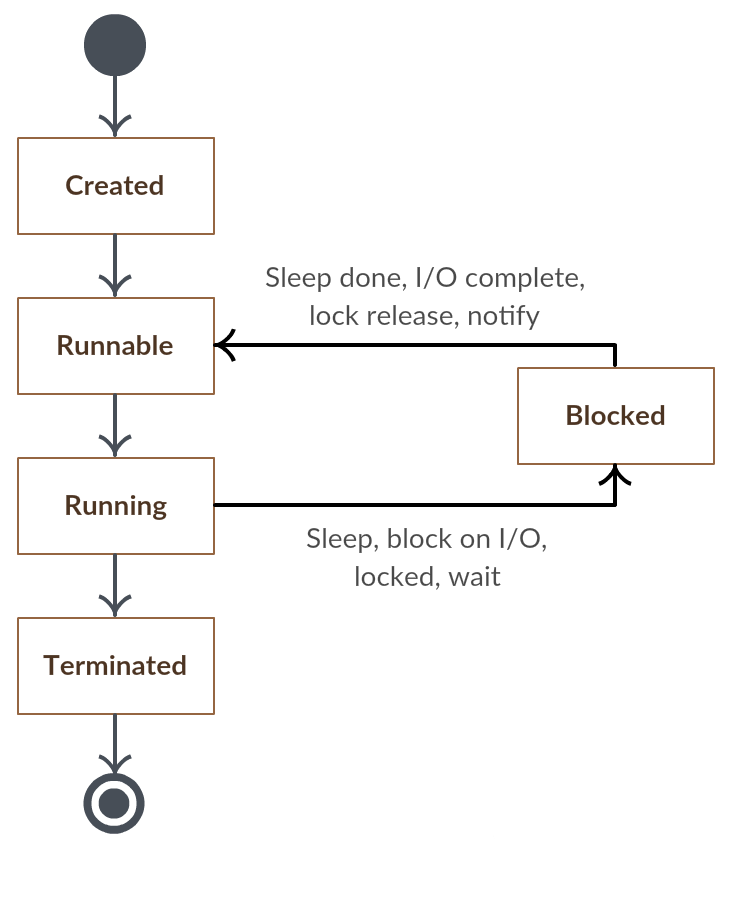

Reference Book : [자바를 다루는 기술 (2014)](https://www.gilbut.co.kr/book/view?bookcode=BN000854), 김병부, 길벗

---

## Static

static으로 선언된 리소스들은 JVM 메모리 안에 *딱 하나만* 생성된다. 또한 static 리소스들은 JVM 상에서 조금 다른 방법으로 동작한다. static 으로 선언된 리소스들은 인스턴스화 과정 없이 실행 가능한 형태로 메모리에 바로 생성되고, 모든 객체들이 공유할 수 있다. static은 클래스 로딩 시에 생성되고, JVM이 종료되면서 메모리에서도 없어진다. 

## Abstract Class / Interface

(* 내 생각)

어차피 추상 메소드 정의 후 자식 클래스에서의 구현을 강제하는 것은 똑같다.  
일부 구현체를 허용하냐(Abstract class) 허용하지 않느냐(Interface)의 차이, 그리고 다중 상속 개념을 포함하는지의 차이이다. 

여러 자료를 찾아봐도 abstract class의 장점이 막 와닿지는 않는다. 그냥 class를 상속하고 자식별로 구현이 필요한 기능이 있다면 interface로 정의해서 붙여버리면 되지 않나? 이쪽이 interface를 붙였다 뗐다 하는 확장성에서도 유리할거고. 코드나 파일의 파편화를 줄일 수 있다는 장점 말고는 떠오르지 않는다.

경험으로 느끼는 수밖에 없을거같다..


## Collection

TBW

## Exception

TBW

---

## Generic

> 클래스 내부에서 사용할 타입을 외부에서 지정하는 기법

ArrayList<<b>String</b>> strList = new ArrayList<<b>String</b>>();  
ArrayList<<b>Integer</b>> intList = new ArrayList<<b>Integer</b>>();

이런식으로 ArrayList *내부에서 쓰일 타입을 외부에서 지정*해주는 개념  
<b>제네릭이 없었다면?</b> - StringArrayList, IntegerArrayList와 같이 타입마다 구현이 필요했을 것이다.

### Wildcard와 다이아몬드 지시자

```java
ArrayList<String> arrayList = new ArrayList<String>();  
Hashtable<String, String> hashTable = new Hashtable<String, String>();
```

위 클래스들의 Java API 문서에는

Class ArrayList<<b>E</b>>  
Class Hashtable<<b>K</b>, <b>V</b>>

와 같이 <>(다이아몬드) 안에 특정 타입이 아닌 E, K, V 등의 알파벳으로 설명되어있다. 이것을 *와일드카드 문자*라고 한다.

제네릭은 클래스 내부에서 사용할 클래스를 외부에서 정해주는 것이라고 했는데, 뭐가 들어올진 몰라도 일단 구현은 해야하니 와일드카드 문자로 대체해서 써놓는 것.

보통 클래스의 성격에 따라 앞글자를 따서 와일드카드 문자를 사용한다  
<b>E</b> - 'E'lement  
<b>K</b> - 'K'ey  
<b>V</b> - 'V'alue  
<b>T</b> - 'T'ype  
<b>N</b> - 'N'umber  
<b>?</b> - ?는 모든 클래스를 의미한다. 단, 클래스 선언부에는 사용할 수 없고, 뒤에 언급할 <b>확장 문법</b>에서만 사용할 수 있다.

#### 주의사항

1. 와일드카드 중복 사용은 불가  
public class ValueMapper<T, T> 같이  와일드 카드를 중복해서 사용하는 것은 JVM이 매개변수 T를 구분하지 못하기 때문에 불가능.  
public class ValueMapper<K, V> 같이 사용해야함.

2. 클래스 선언부에서 사용한 문자만 클래스 내부에서 사용 가능

```java
public class ValueMapper<T> {
    private T t;
    public ValueMapper(T t) {...}

    public void setValue(T t) {
        this.t = t;
    }

    public T getValue() {
        return t;
    }
}
````

```java
ValueMapper<String> sMapper = new ValueMapper<String>();
ValueMapper<Integer> iMapper = new ValueMapper<Integer>();

sMapper.setValue("Hello");
iMapper.setValue(7);
```

선언할 때는 와일드카드 문자로 선언해놓고, 클래스 인스턴스 시 사용할 클래스를 지정

### 제네릭 확장 문법

외부에서 사용할 클래스를 지정한다고 해도 지나친 자유를 주면 예외처리에 혼란을 줄 수 있다. 이를 방지하기 위해 사용될 클래스 범위를 제한할 수 있는 *extends* 기능이 존재한다.

(*extends 외에 super 개념으로도 확장가능)

```java
1. public class MyCase<T extends Number> {}
2. public class MyBox<T extends Comparable> {}
3. public void setValue(Collection<? extends T> collection) {}
```

제네릭에서 사용되는 extends는 상속의 extends와 인터페이스의 implements를 모두 포함한다.

1번 구문의 경우 java.lang.Number 를 상속받는 클래스만 제네릭으로 사용가능하다.

2번 구문은 Comparable 인터페이스가 구현된 클래스만 제네릭으로 사용가능하다.

3번 구문은 <? extends <b>T</b>>와 같이 제한할 타입 또한 와일드카드 문자를 사용할 수 있다는 것을 보여주는 에제이다. 말하자면 T가 뭔지는 모르겠지만 T 를 상속받는 클래스를 사용하겠다는 뜻.

---

## Threading

### Thread? Runnable? start()? run()?

<b>*Thread*</b> 클래스를 상속하거나, <b>*Runnable*</b> 인터페이스를 구현한 클래스를 만든다.  
쓰레드의 동작이 정의된 <b>.run()</b> 메소드를 override 해서 구현해야한다.  
Thread를 상속한 경우에는 .run() 메소드를 실행하면 되지만, Runnable을 사용한 경우 그 자체로는 실행할 수 없고, 그 Runnable을 매개변수로 하는 새로운 Thread 객체를 생성해서 사용해야 한다.

```java
public class Thread extends Object implements Runnable
```

Thread 클래스 자체도 위의 코드처럼 Runnable 인터페이스를 구현하고는 있다. (매개변수로 들어온 Runnable 객체의 .run() 메소드를 실행시키는 내용이다.)

.run() 메소드는 그냥 단순한 메소드일 뿐이라 그냥 실행한다고 새로운 쓰레드에서 실행되지는 않는다. <b>*.start()*</b>로 실행해야 별도의 쓰레드에서 동작한다.

### Thread State Machine



<b>Create</b> - Thread 객체가 생성되고 아직 .start()가 호출되지 않은 상태  
<b>Runnable</b> - .start()가 호출되어 스레드 풀에 들어가고 스케쥴러에 의해 실행 되기를 기다리는 상태  
<b>Running</b> - 실행될 차례가 되어 실제로 .run() 메소드가 실행된 상태  
<b>Waiting, Blocked</b> - .run() 메소드가 아직 완료되지 않아서 쓰레드는 유지되지만 동작하고는 있지 않은 상태. .notify() 메소드에 의해 다시 Runnable 상태로 변경된다.  
<b>Done</b> - .run() 메소드가 완료되어 쓰레드가 종료

### Concurrency

쓰레드 사용시 가장 큰 이슈는 역시 리소스 공유 과정에서의 데이터 동기화 문제일 것이다.

```java
public class ConcurrentSample implements Runnable {
    private int res = 0;

    public static void main(String[] args) {
        ConcurrentSample concurrentSample = new ConcurrentSample();
        Thread th1 = new Thread(concurrentSample);
        Thread th2 = new Thread(concurrentSample);

        th1.start();
        th2.start();

        try {
            th1.join();
            th2.join();
        } catch(InterruptedException e) {
            e.printStackTrace();
        }

        System.out.println(concurrentSample.res);
    }

    @Override
    public void run() {
        sum();
    }

    private void sum() {
        for(int i = 0; i < 10000; i++) 
            res++;
    }
}
--- 
Result : 12594 (실행할때마다 결과 다름)
```

위의 예제 코드는 res에 10000을 더해주는 프로세스가 2번 실행되니, 만약 데이터 동기화가 유지되면서 수행된다면 예상되는 결과값은 20000일 것이다. 하지만 실제로는 두 쓰레드가 동시에 res에 접근하기 때문에 Concurrency가 유지되지 않아 실행할 때마다 20000 보다는 작은 랜덤한 결과가 얻어지게 된다.

이러한 데이터 동기화 문제를 해결하기 위한 Critical section 개념이 역시 자바에도 있다. <b>*synchronized*</b> 구문으로 사용할 수 있다.

```java
// 메소드 전체를 Synchronized로 지정
public synchronized void reportCurrentStats() {...}

// 메소드 일부를 Synchronized로 지정
public void reportCurrentStats() {
    // 동기화 블록 방식을 사용시 동기화 객체를 지정해줘야한다.
    synchronized(this) { 
        ...
    }
}
```

synchronized 구문을 적용해서 위 예제의 문제를 해결할 수 있다.

```java
private synchronized void sum() {
    for(int i = 0; i < 10000; i++) 
        res++;
}
```

synchronized 선언이 됐기 때문에 한 쓰레드가 res를 사용하고 있다면 다른 쓰레드는 대기하기 때문에 Concurrency가 유지된다. 물론 '대기'하는 쓰레드가 발생하니 성능에 문제가 생기지 않도록 공유 리소스에 대해서만 정확히 동기화 처리를 하도록 주의해야한다.

### Producer - Consumer

멀티 쓰레드를 잘 관리하기 위해 코딩 패턴들이 고안됐다. 그 중 가장 일반적으로 쓰이는게 *Producer - Consumer* 패턴이다. 

<b>Producer</b> - 작업을 생성해서 Queue에 쌓는 역할만 한다  
<b>작업 Queue</b> - Producer가 생성한 작업을 저장하고 있다가 Consumer에게 전달  
<b>Consumer</b> - 작업 Queue로 부터 작업을 할당받아서 처리하기만 한다  

즉 Concurrency는 작업 Queue가 다 관리해줄테니 Produce와 Consumer는 신경쓰지말고 자기 할일만 하면 된다.

```java 
// Producer-Consumer 예제
import java.util.LinkedList;

public class ThreadManager {
    public static void main(String[] args) {
        ResourceQueue<Integer> q = new ResourceQueue<Integer>();
        Thread producer = new Thread(new Producer(q), "producer");
        Thread consumer1 = new Thread(new Consumer(q), "consumer1");
        Thread consumer2 = new Thread(new Consumer(q), "consumer2");

        producer.start();
        consumer1.start();
        consumer2.start();
    }
}

class ResourceQueue<T> {
    private LinkedList<T> jobs = new LinkedList<T>();

    public synchronized void clear() {
        jobs.clear();
    }

    public synchronized T pop() throws InterruptedException {
        T t = null;
        if(!jobs.isEmpty())
            t = jobs.removeFirst();
        return t;
    }

    public synchronized void put(T t) {
        jobs.addLast(t);
    }
}

class Producer implements Runnable {
    private ResourceQueue<Integer> q;

    public Producer(ResourceQueue<Integer> q) {
        this.q = q;
    }

    @Override
    public void run() {
        for(int i = 0; i < 10; i++) {
            q.put(i);
            try {
                Thread.sleep(1000);
            } catch(InterruptedException e) {
                e.printStackTrace();
                break;
            }
        }
    }
}

class Consumer implements Runnable {
    private ResourceQueue<Integer> q;

    public Consumer(ResourceQueue<Integer> q) {
        this.q = q;
    }

    @Override
    public void run() {
        while(!Thread.interrupted()) {
            try {
                Integer i = q.pop();
                if(i != null) {
                    System.out.println(Thread.currentThread().getName() + " pop : " + String.valueOf(i));
                }
            } catch(InterruptedException e) {
                e.printStackTrace();
                break;
            }
        }
    }
}
```

위의 예제에서 consumer는 while로 계속 q를 체크하고 있기 때문에 전체적인 성능 저하가 예상된다. 자바는 이러한 문제를 해결하기 위해 특정 조건을 기반으로 스레드를 제어할 수 있도록 메소드를 제공한다.

<b>wait()</b> - 특정 쓰레드가 점유하고 있던 lock이 해제되고 대기 중이던 다른 쓰레드가 실행가능하게 된다  
<b>notify()</b> - 쓰레드 스케줄러가 우선 순위 및 대기 시간을 고려하여 대기중이던 쓰레드 중에서 하나를 선택하여 Runnable 상태로 변경시킨다

폴링 방식으로 동작하던 위 예제를 다음 예제와 같이 인터럽트 방식으로 변경하면, Queue에 자원이 없는 경우 Consumer 쓰레드가 동작하지 않으므로 프로세스의 효율을 높일 수 있다.

```java
class ResourceQueue<T> {
    private LinkedList<T> jobs = new LinkedList<T>();

    public synchronized void clear() {
        jobs.clear();
    }

    public synchronized T pop() throws InterruptedException {
        T t = null;
        if(jobs.isEmpty())
            this.wait();    
        
        t = jobs.removeFirst();
        return t;
    }

    public synchronized void put(T t) {
        jobs.addLast(t);
        this.notify();
    }
}
```